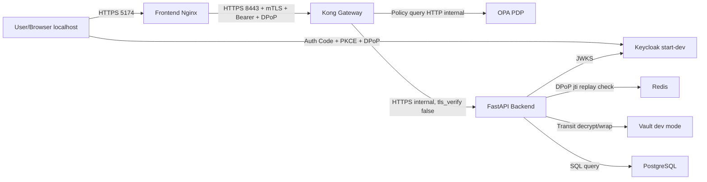
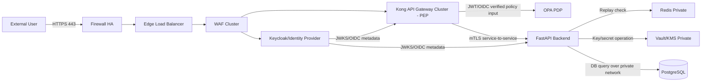

# Báo cáo chi tiết hiện trạng và kiến trúc bảo mật Cloud API Security

Ngày lập báo cáo: 03/06/2026

Phạm vi phân tích: mã nguồn và cấu hình hiện có trong project, bao gồm Docker Compose, Kong Gateway, Keycloak, OPA, FastAPI Backend, Redis, Vault, PostgreSQL, Frontend, script kiểm thử và thư mục evidence. Theo yêu cầu, báo cáo không dựa trên việc đọc các file Markdown có sẵn.

## 1. Tóm tắt điều hành

Project hiện tại là một mô hình thử nghiệm bảo mật API chạy local bằng Docker Compose. Hệ thống đã triển khai được nhiều thành phần cốt lõi đúng với hướng kiến trúc bạn đang thiết kế: người dùng, frontend, Keycloak, Kong Gateway, OPA, backend FastAPI, Redis replay cache, Vault/KMS và PostgreSQL.

Về mặt ý tưởng bảo mật, project đã có các cơ chế quan trọng:

- Xác thực người dùng bằng Keycloak.
- Luồng đăng nhập Authorization Code + PKCE cho SPA.
- Access token được ký bằng thuật toán bất đối xứng ES256.
- DPoP-bound access token để giảm rủi ro token bị replay như bearer token thông thường.
- Kong Gateway nhận traffic HTTPS, bật TLS 1.3 và yêu cầu client certificate.
- Backend xác minh JWT đầy đủ bằng JWKS từ Keycloak.
- Backend xác minh DPoP proof và chống replay bằng Redis.
- OPA đóng vai trò Policy Decision Point để quyết định phân quyền theo role, method và path.
- Dữ liệu nhạy cảm có hướng mã hóa bằng AES-256-GCM.
- DEK không được lưu raw trực tiếp trong app mà được unwrap thông qua Vault Transit.
- PostgreSQL, Redis, Vault, OPA và Backend được đặt trên Docker internal network.

Tuy nhiên, hệ thống hiện tại vẫn là môi trường lab/dev, chưa phải kiến trúc production hoàn chỉnh. Những điểm chưa ổn chính nằm ở chỗ:

- Nhiều service nội bộ vẫn expose port ra host để tiện test local.
- Keycloak đang chạy `start-dev`.
- Vault đang chạy dev mode với root token.
- Kong gọi backend qua HTTPS nhưng `tls_verify: false`, nghĩa là có mã hóa đường truyền nhưng chưa xác thực chặt chứng chỉ server backend.
- Kong chưa xác minh chữ ký JWT đầy đủ trước khi đưa claim role sang OPA.
- Backend mới là nơi xác minh JWT và DPoP thật sự.
- Kiến trúc hiện tại chưa có Firewall HA, Edge Load Balancer và WAF Cluster như sơ đồ mục tiêu.
- Các chứng chỉ hiện tại là chứng chỉ local/self-signed do CA nội bộ của project tạo ra, chưa phải certificate chain production được trình duyệt hoặc client bên ngoài tin cậy mặc định.
- Token frontend đang lưu trong `localStorage`, DPoP private key lưu trong `sessionStorage`, nên vẫn còn rủi ro nếu có XSS.

Kết luận ngắn gọn: project hiện tại phù hợp để chứng minh cơ chế bảo mật API ở mức prototype/local lab. Nếu muốn triển khai đúng theo sơ đồ kiến trúc bạn đưa ra, cần nâng cấp thành mô hình có DMZ/Edge thật, domain thật, chứng chỉ tin cậy, không expose service nội bộ, gateway xác minh token đầy đủ trước khi authorize, và chuyển Keycloak/Vault sang production mode.

## 2. Câu hỏi 1: Key hiện tại đã là raw chưa?

### 2.1. Nếu đang nói về key mã hóa dữ liệu

Hiện tại, nếu xét key mã hóa dữ liệu DEK, project đã đi theo hướng không lưu raw key trực tiếp trong backend environment để sử dụng lâu dài. Backend không đọc một biến kiểu `RAW_DEK` rồi dùng thẳng. Thay vào đó, backend lấy DEK thông qua Vault Transit:

- `VAULT_WRAPPED_DEK` chứa DEK đã được Vault Transit bọc lại.
- Backend gọi endpoint `transit/decrypt/{VAULT_KEY_NAME}` của Vault.
- Vault trả plaintext DEK cho backend.
- Backend dùng DEK này trong bộ nhớ runtime để mã hóa/giải mã bằng AES-GCM.

Điều này có nghĩa là:

- Raw DEK không nên nằm trực tiếp trong source code.
- Raw DEK không nên nằm trực tiếp trong database.
- Raw DEK không nên nằm trực tiếp trong frontend.
- Raw DEK không nên commit vào repo.
- Raw DEK chỉ xuất hiện tạm thời trong RAM của backend khi backend cần mã hóa hoặc giải mã.

Đây là cách làm bình thường của envelope encryption. Khi ứng dụng cần mã hóa hoặc giải mã dữ liệu, plaintext DEK bắt buộc phải xuất hiện ở một điểm thực thi tin cậy. Điểm cần đảm bảo là plaintext DEK chỉ xuất hiện trong vùng tin cậy, không xuất hiện ở vùng untrusted.

Trong project hiện tại, vùng xử lý DEK là backend/private side, không phải browser hoặc external/untrusted side. Vì vậy, câu trả lời là: key dữ liệu không còn được thiết kế như raw key chạy ở phía untrusted. Tuy nhiên, do Vault đang chạy dev mode nên mức bảo vệ hiện tại chỉ phù hợp lab, chưa đủ production.

### 2.2. Nếu đang nói về key JWT

JWT signing key nằm ở Keycloak. Realm export cấu hình:

- `defaultSignatureAlgorithm: ES256`
- client có `access.token.signed.response.alg: ES256`
- client có `id.token.signed.response.alg: ES256`

Điều này nghĩa là access token và ID token được Keycloak ký bằng thuật toán bất đối xứng ES256. Backend lấy public key qua JWKS để verify token. Private key ký token không nằm ở frontend hoặc backend app.

Kết luận: JWT key không phải raw key bị app/client sử dụng trực tiếp. Keycloak là nơi phát hành và ký token.

### 2.3. Nếu đang nói về TLS key/certificate

Project có script sinh chứng chỉ local trong `scripts/gen_certs.py`. Script này tạo:

- CA nội bộ: `ca.crt`, `ca.key`
- Kong cert/key
- Frontend cert/key
- Backend cert/key
- Client cert/key/p12 cho mTLS

Các chứng chỉ server được ký bởi CA nội bộ của project. Đây là phù hợp cho lab local, nhưng không tương đương chứng chỉ production được cấp bởi CA tin cậy công khai hoặc CA nội bộ doanh nghiệp được quản trị đúng cách.

Kết luận: TLS key không phải raw key gửi cho user. Tuy nhiên, chứng chỉ hiện tại chỉ là local/internal CA, chưa phải production trust chain.

## 3. Câu hỏi 2: Server có được ký không? Server được design ra sao?

Câu “server có được ký không” cần tách thành ba lớp khác nhau.

### 3.1. Token do server/IdP phát hành có được ký không?

Có. Keycloak ký token bằng ES256. Backend xác minh chữ ký token bằng JWKS.

Backend hiện có logic:

- Lấy JWKS từ Keycloak.
- Đọc `kid` trong JWT header.
- Chọn public key tương ứng.
- Verify token với algorithm `ES256`.
- Verify `audience`.
- Verify `issuer`.
- Verify expiry.

Vì vậy, ở lớp token, hệ thống đã có chữ ký và backend có xác minh chữ ký.

### 3.2. Server certificate có được ký không?

Có, nhưng chỉ ở mức local lab. Kong, frontend và backend có certificate được ký bởi CA nội bộ do project tự sinh.

Điều này tạo được TLS/mTLS trong môi trường local, nhưng client bên ngoài sẽ không tin cậy mặc định nếu chưa import CA nội bộ. Khi triển khai thật, nên dùng:

- Public CA nếu service public ra Internet.
- Enterprise/private CA nếu hệ thống nội bộ.
- Certificate lifecycle rõ ràng: cấp phát, rotate, revoke, expiry monitoring.

### 3.3. Response của server có được ký ở tầng ứng dụng không?

Chưa. Hiện tại server response không có chữ ký riêng kiểu JWS response, HTTP Message Signatures hoặc payload signature.

Toàn vẹn và xác thực response hiện đang dựa vào:

- TLS giữa client và gateway/frontend.
- mTLS ở Kong.
- JWT/DPoP để bảo vệ request.
- Backend verify token và DPoP.

Nếu yêu cầu nghiên cứu là “response từ server phải được ký độc lập với TLS”, thì hiện tại chưa có. Khi đó cần bổ sung một trong các hướng:

- Ký payload response bằng JWS.
- Dùng HTTP Message Signatures.
- Dùng detached signature cho body.
- Dùng key trong Vault/KMS/HSM để ký response.

Tuy nhiên, với kiến trúc API thông thường, TLS/mTLS thường là lớp bảo vệ chính cho channel integrity. Response signing chỉ cần nếu bài toán yêu cầu non-repudiation, audit độc lập, hoặc message integrity end-to-end qua nhiều proxy không hoàn toàn tin cậy.

## 4. Câu hỏi 3: Có chạy raw trên untrusted không?

Nếu “raw” là raw encryption key thì hiện tại không thấy raw DEK chạy ở vùng external/untrusted. Raw DEK chỉ được backend unwrap từ Vault và sử dụng trong backend runtime.

Vùng external/untrusted hiện tại gồm:

- Browser/user.
- Frontend JavaScript.
- Request từ người dùng vào gateway.

Những vùng này không có DEK.

Tuy nhiên, có một loại credential nhạy cảm khác đang nằm trong browser:

- Access token và refresh token được lưu trong `localStorage`.
- DPoP private JWK được lưu trong `sessionStorage`.

DPoP giúp giảm rủi ro token bị lấy rồi replay ở máy khác, vì access token bị ràng buộc với khóa DPoP. Nhưng nếu có XSS chạy trong cùng browser context, attacker có thể đọc storage hoặc thực hiện request thay mặt người dùng. Vì vậy, project đã tốt hơn bearer token thuần, nhưng chưa phải mô hình frontend token storage an toàn nhất.

Khuyến nghị nếu triển khai thật:

- Ưu tiên BFF pattern, để token nằm ở backend-for-frontend thay vì browser JavaScript.
- Hoặc dùng cookie `HttpOnly`, `Secure`, `SameSite`.
- Nếu vẫn dùng SPA thuần, cần CSP nghiêm ngặt, Trusted Types, chống XSS, kiểm soát dependency và không lưu refresh token dài hạn trong `localStorage`.

## 5. Câu hỏi 4: Đã có giao thức an toàn từ người dùng đến server chưa?

Có, nhưng mới ở mức local/lab.

### 5.1. Từ user đến frontend

Frontend chạy bằng Nginx và có HTTPS:

- HTTP port 80 redirect sang HTTPS.
- HTTPS dùng port 443 trong container, map ra `5174` trên host.
- Cấu hình TLS 1.3.
- Có HSTS.
- Có `X-Frame-Options: DENY`.
- Có `X-Content-Type-Options: nosniff`.

Trong môi trường local, user truy cập `https://localhost:5174`.

### 5.2. Từ user/frontend đến API Gateway

Kong Gateway nhận API traffic qua `https://localhost:8443`.

Kong có các cấu hình bảo mật:

- Chỉ mở HTTPS proxy listener.
- TLS 1.3.
- HTTP/2.
- Yêu cầu client certificate.
- Verify client certificate bằng CA nội bộ `certs/ca.crt`.
- Có HSTS header.
- Có rate limiting.
- Có security headers.
- Có plugin JWT hardening.
- Có plugin OPA authorization.

Điểm mạnh: API không chỉ dùng HTTPS mà còn dùng mTLS ở Kong. Request thiếu client certificate bị chặn trước khi vào backend.

Điểm hạn chế: đây là mTLS local bằng client certificate của project, chưa phải phân phối chứng chỉ client production cho người dùng thật. Nếu người dùng là browser public thông thường, bắt mTLS trực tiếp ở browser có thể gây khó vận hành. Trong production, mTLS thường phù hợp hơn cho service-to-service hoặc client doanh nghiệp có quản trị certificate.

### 5.3. Từ user đến Keycloak

Frontend dùng Authorization Code + PKCE để đăng nhập với Keycloak. Đây là luồng đúng cho SPA hiện đại.

Ngoài PKCE, project còn bật DPoP:

- Frontend tạo key pair ECDSA P-256 bằng WebCrypto.
- Khi đổi authorization code lấy token, frontend gửi DPoP proof.
- Keycloak cấp DPoP-bound access token.
- Backend yêu cầu access token có `cnf.jkt`.
- Backend kiểm tra proof được ký bởi khóa tương ứng với `cnf.jkt`.

Điểm hạn chế: Keycloak hiện expose local port `8082` và chạy `start-dev`. Trong sơ đồ production, Keycloak cần nằm sau edge/reverse proxy/WAF phù hợp và dùng hostname/certificate thật.

### 5.4. Từ Kong đến backend

Kong gọi backend bằng URL HTTPS `https://api-backend:9000`. Backend có thể chạy TLS nếu có cert.

Nhưng trong Kong config, upstream có:

```yaml
tls_verify: false
```

Điều này nghĩa là đường truyền có thể được mã hóa, nhưng Kong không xác thực chặt certificate của backend. Đây là điểm cần sửa nếu muốn đạt production-grade service-to-service TLS.

Khuyến nghị:

- Bật `tls_verify: true`.
- Cấu hình CA trust cho Kong.
- Dùng certificate có SAN đúng tên service nội bộ.
- Cân nhắc mTLS giữa Kong và backend.

## 6. Kiến trúc hiện tại của project

Kiến trúc thực tế hiện nay gần với mô hình rút gọn sau:



Các network Docker:

- `edge-net`: frontend, Kong, Keycloak.
- `internal-net`: backend, PostgreSQL, Redis, Vault, OPA, Keycloak, Kong.
- `obs-net`: Loki, Grafana, Prometheus, Promtail.

Về mặt phân vùng logic, project đã có ý thức tách edge và internal. Tuy nhiên, vì chạy local Docker Compose nên nhiều service vẫn publish port ra host để tiện kiểm thử. Điều này làm mô hình chưa phản ánh đúng boundary production.

## 7. So sánh với sơ đồ kiến trúc mục tiêu bạn đưa ra

Sơ đồ mục tiêu của bạn có bốn vùng chính:

- External/Untrusted.
- DMZ/Edge.
- Application/Private.
- Data/Security.

Trong sơ đồ đầy đủ, request đi qua:

1. User gửi Auth/API request.
2. Firewall HA chỉ cho phép TCP/443.
3. Edge Load Balancer route traffic.
4. WAF Cluster lọc request HTTP độc hại.
5. API Gateway Cluster làm PEP.
6. Gateway xác thực token với Identity Provider.
7. Gateway hỏi OPA PDP.
8. Gateway forward business request đến backend.
9. Backend kiểm tra replay bằng Redis.
10. Backend dùng KMS/Vault để thao tác key/secret.
11. Backend query database.
12. Response đi ngược lại qua gateway, WAF, LB, firewall về user.

Trong project hiện tại:

| Thành phần trong sơ đồ mục tiêu | Trạng thái hiện tại |
| --- | --- |
| User | Có, chạy trên browser local |
| Firewall HA | Chưa có triển khai thực sự |
| Edge Load Balancer | Chưa có |
| WAF Cluster | Chưa có |
| API Gateway Cluster | Có Kong nhưng chỉ một node, DB-less |
| Identity Provider | Có Keycloak nhưng đang `start-dev` |
| OPA PDP | Có |
| Backend Service | Có FastAPI |
| Redis Replay Cache | Có |
| KMS/Vault | Có Vault Transit nhưng dev mode |
| Database | Có PostgreSQL |
| Observability | Có optional profile: Prometheus, Loki, Grafana |

Vì vậy, project hiện tại giống sơ đồ thứ hai hơn sơ đồ thứ nhất. Nó là bản rút gọn để chứng minh luồng bảo mật, chưa phải triển khai hạ tầng đầy đủ.

## 8. Vì sao hiện tại “chỉ là localhost” nên có vẻ không ổn?

`localhost` không sai khi làm lab hoặc demo. Nó giúp kiểm chứng nhanh các cơ chế:

- TLS local.
- mTLS local.
- JWT ES256.
- PKCE.
- DPoP.
- OPA policy.
- Redis replay cache.
- Vault Transit.
- AES-GCM.
- BOLA guard.
- SSRF guard.

Nhưng `localhost` không chứng minh đầy đủ môi trường thực tế vì:

- Không có public DNS.
- Không có certificate chain được client bên ngoài tin mặc định.
- Không có Internet-facing firewall rule thực.
- Không có Load Balancer thật.
- Không có WAF thật.
- Không có HA/cluster thật.
- Không có network segmentation ở mức cloud/VPC/subnet/security group.
- Không có secret lifecycle production.
- Không có hardening production cho Keycloak và Vault.
- Các service nội bộ vẫn expose port ra host.

Do đó, khi viết báo cáo đồ án, nên mô tả rõ:

“Hệ thống hiện tại là prototype local theo kiến trúc rút gọn, dùng để kiểm chứng các cơ chế bảo mật API. Kiến trúc mục tiêu cần triển khai trên môi trường có DMZ/Edge, Application/Private và Data/Security zone riêng, với Firewall, Load Balancer, WAF, chứng chỉ tin cậy, production Keycloak/Vault và không expose service nội bộ.”

## 9. Phân tích chi tiết từng thành phần

### 9.1. Keycloak

Điểm tốt:

- Có realm `cloudapi`.
- Token ký bằng ES256.
- SPA client dùng PKCE S256.
- Bật DPoP-bound access token.
- Access token lifespan ngắn.
- Refresh token có cấu hình revoke và max reuse.
- Có role `admin`, `staff`, `customer`.
- Có cấu hình Google Identity Provider.

Điểm chưa ổn:

- Keycloak đang chạy `start-dev`.
- Port `8082` expose ra host.
- Client SPA còn bật Direct Access Grant.
- Realm export có demo users và demo password.
- Google client secret còn placeholder.
- Chưa có cấu hình production hostname/proxy đầy đủ.

Khuyến nghị:

- Chuyển sang Keycloak production mode.
- Đặt Keycloak sau reverse proxy/ingress với domain thật.
- Tắt Direct Access Grant cho SPA nếu không bắt buộc.
- Không đưa demo password vào cấu hình production.
- Quản lý secret bằng Vault/KMS/secret manager.
- Giới hạn redirect URI và web origin theo domain thật.

### 9.2. Kong Gateway

Điểm tốt:

- Chỉ mở HTTPS proxy.
- TLS 1.3.
- Yêu cầu client certificate.
- Có HSTS.
- Có rate limiting.
- Có security headers.
- Có plugin chặn token `alg=none`.
- Có kiểm tra `kid` phải tồn tại trong JWKS.
- Có plugin gọi OPA để authorize.

Điểm chưa ổn:

- `tls_verify: false` khi gọi backend.
- Kong Admin API expose port `8001`.
- OPA plugin lấy role bằng cách decode JWT payload chưa verify chữ ký.
- Gateway chưa thật sự verify JWT đầy đủ trước khi OPA quyết định.
- Chưa có WAF layer phía trước Kong.
- Chưa có cluster/HA.

Khuyến nghị:

- Bật TLS verification cho upstream backend.
- Không expose Admin API ra ngoài.
- Thêm plugin OIDC/JWT verification đầy đủ tại Kong.
- Chỉ gọi OPA sau khi token đã được verify.
- Nếu Kong truyền identity xuống backend, nên truyền identity đã verify và có bảo vệ, ví dụ signed internal header hoặc mTLS service identity.
- Thêm WAF ở trước Kong nếu theo đúng sơ đồ mục tiêu.

### 9.3. OPA

Điểm tốt:

- OPA đã được tách thành PDP.
- Policy có default deny.
- Policy phân quyền theo role, method và path.
- Kong gọi OPA trước khi forward request.

Điểm chưa ổn:

- Input role do Kong tự decode từ JWT payload chưa verify.
- Policy hiện còn đơn giản, chủ yếu theo role/method/path.
- OPA port `8181` vẫn publish ra host trong Docker Compose.

Khuyến nghị:

- Đảm bảo input đưa vào OPA là claim đã verify.
- Không expose OPA ra ngoài.
- Bổ sung policy theo resource ownership nếu muốn đưa một phần BOLA decision vào policy layer.
- Bổ sung test policy cho các trường hợp deny quan trọng.

### 9.4. Backend FastAPI

Điểm tốt:

- Có middleware xác thực.
- Verify JWT đầy đủ.
- Verify DPoP đầy đủ.
- Chống DPoP replay bằng Redis.
- Có BOLA guard cho order.
- Có SSRF guard.
- Có AES-GCM encryption helper.
- Có health endpoint.

Điểm chưa ổn:

- Backend port `9000` expose ra host để dev test.
- CORS đang `allow_origins=["*"]`.
- Một số endpoint nhạy cảm dựa nhiều vào OPA/Kong, nếu gọi thẳng backend có thể giảm bảo vệ.
- Database password có fallback trong code.
- Docs/OpenAPI public trong middleware.

Khuyến nghị:

- Không publish backend port trong production.
- Chỉ cho Kong gọi backend qua private network.
- Giới hạn CORS theo frontend domain.
- Backend vẫn phải tự enforce authorization ở endpoint nhạy cảm.
- Bỏ fallback password khỏi code.
- Tắt hoặc bảo vệ docs trong production.

### 9.5. Redis replay cache

Điểm tốt:

- Dùng để lưu DPoP `jti`.
- Backend dùng `SET nx` để chặn replay cùng proof.
- Có TTL cho jti.

Điểm chưa ổn:

- Redis port `6380` expose ra host.
- Chưa thấy cấu hình auth/TLS cho Redis.

Khuyến nghị:

- Không expose Redis ra ngoài.
- Nếu deployment nhiều node hoặc network không hoàn toàn tin cậy, bật Redis auth/TLS.
- Theo dõi dung lượng key replay để tránh abuse.

### 9.6. Vault/KMS

Điểm tốt:

- Dùng Vault Transit.
- Có script init transit key.
- Có policy cho encrypt/decrypt.
- Backend không dùng raw DEK trực tiếp từ env.

Điểm chưa ổn:

- Vault dev mode.
- Root token từ env.
- Vault port `8200` expose ra host.
- Dev mode không persist dữ liệu và tự unseal.

Khuyến nghị:

- Dùng Vault production mode.
- Dùng storage backend persist.
- Dùng auto-unseal hoặc quy trình unseal an toàn.
- Không dùng root token cho backend.
- Dùng AppRole, JWT auth, Kubernetes auth hoặc cloud IAM auth.
- Bật audit log.
- Có quy trình rotate key/DEK.

### 9.7. PostgreSQL

Điểm tốt:

- Chạy trong internal network.
- Có healthcheck.
- Có volume persist local.

Điểm chưa ổn:

- PostgreSQL port `5434` expose ra host.
- Kết nối DB trong Docker internal chưa thấy TLS.
- Có fallback password trong code.

Khuyến nghị:

- Không publish DB port production.
- Chỉ backend được quyền truy cập DB.
- Dùng secret manager cho DB credentials.
- Bật TLS nếu DB nằm khác host/subnet hoặc qua network shared.
- Backup, migration và least privilege DB user.

### 9.8. Frontend

Điểm tốt:

- Dùng Authorization Code + PKCE.
- Tạo DPoP proof bằng WebCrypto.
- Gửi DPoP khi token exchange và khi gọi API.
- Frontend Nginx có HTTPS TLS 1.3.
- Có HSTS và security headers cơ bản.

Điểm chưa ổn:

- Token lưu trong `localStorage`.
- DPoP private JWK lưu trong `sessionStorage`.
- Chưa thấy CSP nghiêm ngặt.
- Frontend hiện chạy domain localhost.

Khuyến nghị:

- Cân nhắc BFF pattern.
- Nếu vẫn SPA, thêm CSP, Trusted Types, XSS hardening.
- Giảm lifetime token.
- Không lưu refresh token dài hạn trong JS-accessible storage.
- Dùng domain production và redirect URI chính xác.

## 10. Kiến trúc mục tiêu đề xuất

Kiến trúc production nên đi theo mô hình sau:



Ranh giới triển khai:

- External/Untrusted: người dùng và Internet.
- DMZ/Edge: Firewall, Load Balancer, WAF, Kong, public endpoint của Keycloak.
- Application/Private: Backend, OPA, Redis.
- Data/Security: PostgreSQL, Vault/KMS.
- Observability: Prometheus, Loki, Grafana, log pipeline, chỉ cho admin truy cập.

Nguyên tắc quan trọng:

- Internet chỉ được vào TCP/443.
- Không expose DB, Redis, Vault, OPA, Backend trực tiếp ra Internet.
- Gateway xác minh token trước khi authorize.
- Backend verify lại token/DPoP để defense-in-depth.
- Service-to-service dùng mTLS hoặc private service identity.
- Secret/key không nằm trong source code, frontend, log hoặc raw env production.
- Admin API chỉ truy cập qua VPN/bastion/private management network.

## 11. Luồng request an toàn đề xuất

### 11.1. Luồng đăng nhập

1. User truy cập frontend qua HTTPS.
2. Frontend redirect user đến Keycloak qua domain HTTPS production.
3. User đăng nhập tại Keycloak.
4. Frontend nhận authorization code.
5. Frontend dùng PKCE verifier và DPoP proof để đổi code lấy token.
6. Keycloak cấp access token có chữ ký ES256 và có `cnf.jkt`.
7. Frontend dùng access token + DPoP proof để gọi API.

### 11.2. Luồng gọi API

1. User/browser gửi request đến API domain HTTPS.
2. Firewall chỉ cho qua TCP/443.
3. Load Balancer route vào WAF.
4. WAF lọc request bất thường.
5. Kong xác minh TLS/mTLS nếu áp dụng.
6. Kong verify JWT/OIDC.
7. Kong gửi claim đã verify sang OPA.
8. OPA trả allow/deny.
9. Kong forward request sang backend qua mTLS/private network.
10. Backend verify lại JWT.
11. Backend verify DPoP proof.
12. Backend kiểm tra replay bằng Redis.
13. Backend xử lý business logic.
14. Backend gọi Vault nếu cần unwrap/use key.
15. Backend query PostgreSQL.
16. Response đi ngược lại qua Kong/WAF/LB/Firewall về user.

## 12. Danh sách rủi ro hiện tại

| Mức độ | Rủi ro | Giải thích | Hướng xử lý |
| --- | --- | --- | --- |
| Cao | Keycloak `start-dev` | Không phù hợp production | Chuyển production mode |
| Cao | Vault dev mode/root token | Secret/key management chưa an toàn | Dùng Vault production, auth method tối thiểu quyền |
| Cao | Internal services expose port | DB/Redis/Vault/OPA/Backend có thể bị truy cập ngoài ý muốn | Không publish port nội bộ |
| Cao | Kong chưa verify JWT đầy đủ trước OPA | OPA có thể nhận role từ payload chưa verify | Thêm OIDC/JWT verify tại Kong |
| Cao | Kong upstream `tls_verify: false` | Chưa xác thực backend cert | Bật verify và cấu hình CA |
| Trung bình | Token trong `localStorage` | Rủi ro XSS | BFF/httpOnly cookie/CSP |
| Trung bình | Backend CORS wildcard | Không phù hợp production | Giới hạn origin |
| Trung bình | Kong Admin API expose | Rủi ro quản trị gateway | Chỉ bind private/VPN |
| Trung bình | Demo password trong realm | Không dùng được production | Secret rotation, không commit secret |
| Thấp/Trung bình | Chưa có response signing | Chỉ cần nếu yêu cầu message-level integrity | Thêm JWS/HTTP Message Signatures nếu cần |

## 13. Việc nên làm theo thứ tự ưu tiên

Ưu tiên 1:

1. Không expose port nội bộ ra host/public: PostgreSQL, Redis, Vault, OPA, Backend, Kong Admin API.
2. Chuyển Keycloak sang production mode.
3. Chuyển Vault sang production mode.
4. Bật TLS verification từ Kong đến backend.
5. Thêm JWT/OIDC verification đầy đủ ở Kong trước khi gọi OPA.
6. Giới hạn CORS theo domain thật.
7. Xóa demo secret/password khỏi cấu hình production.

Ưu tiên 2:

1. Bổ sung WAF và Load Balancer nếu muốn đúng sơ đồ target.
2. Dùng domain thật và certificate chain thật.
3. Dùng private subnet/security group/VPC segmentation.
4. Backend enforce authorization ở endpoint nhạy cảm, không chỉ dựa vào gateway.
5. Bật audit log cho Keycloak, Kong, Vault và backend.
6. Bảo vệ docs/OpenAPI trong production.

Ưu tiên 3:

1. Cân nhắc BFF pattern để không lưu token trong browser storage.
2. Thêm CSP và frontend hardening.
3. Thêm response signing nếu đề tài yêu cầu.
4. Thêm test tự động cho bypass gateway, forged role payload, DPoP replay, BOLA và SSRF.
5. Bổ sung sơ đồ threat model và data-flow diagram.

## 14. Kết luận cuối cùng

Hệ thống hiện tại đã có nền tảng bảo mật tốt cho một prototype: Keycloak ký token ES256, frontend dùng PKCE và DPoP, Kong bật HTTPS/mTLS, OPA làm policy engine, backend verify JWT/DPoP và chống replay bằng Redis, dữ liệu nhạy cảm có hướng mã hóa bằng AES-GCM với DEK được unwrap qua Vault Transit.

Tuy nhiên, hệ thống chưa phải production-ready vì vẫn đang là local Docker Compose deployment. Các điểm cần sửa quan trọng nhất là Keycloak/Vault dev mode, service nội bộ expose port ra host, Kong chưa verify JWT đầy đủ trước khi gọi OPA, upstream TLS chưa verify backend certificate, và chưa có Firewall/LB/WAF như sơ đồ mục tiêu.

Vì vậy, cách mô tả chính xác nhất là: hiện tại project là bản triển khai rút gọn trên localhost để chứng minh cơ chế bảo mật. Kiến trúc bạn định triển khai trong hình là kiến trúc mục tiêu đầy đủ hơn, cần bổ sung DMZ/Edge thật, Application/Private zone thật, Data/Security zone thật, domain/certificate production, gateway token verification hoàn chỉnh, production Keycloak/Vault và nguyên tắc không expose service nội bộ.
