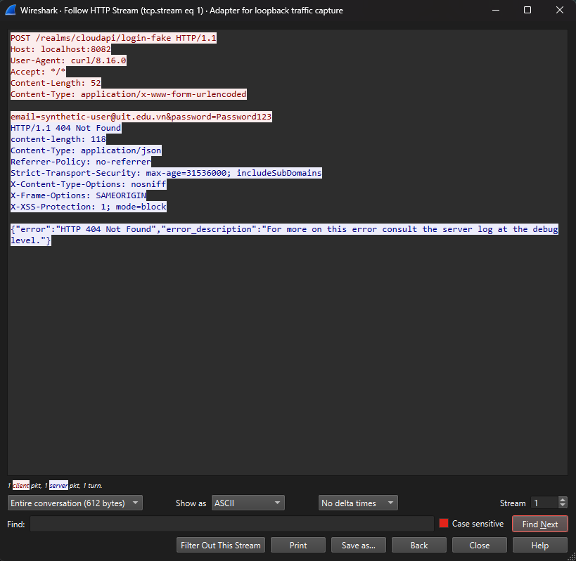
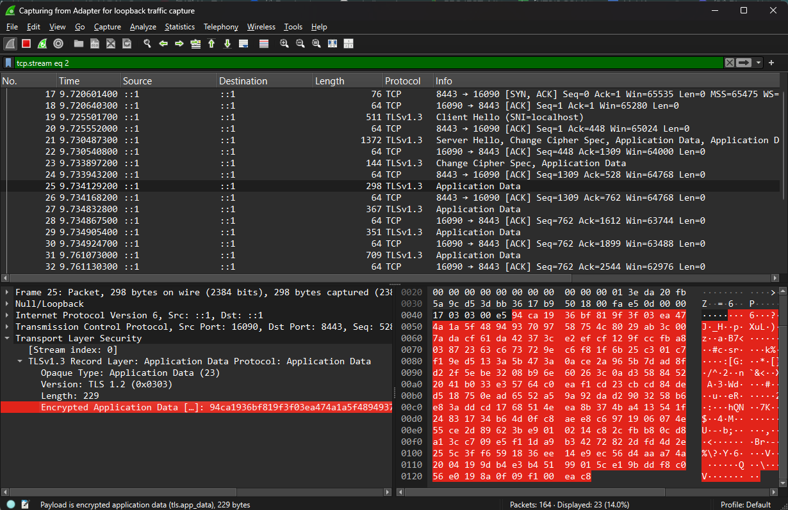

# Đánh giá E-C1: Bảo mật đường truyền bằng TLS (Tính bảo mật - Confidentiality)

## 1. Mục tiêu kiểm thử
Đánh giá mức độ an toàn của dữ liệu truyền tải trên mạng, chứng minh tầm quan trọng của việc mã hóa đường truyền (áp dụng giao thức TLS/HTTPS) để phòng chống các cuộc tấn công nghe lén (Sniffing/Eavesdropping) và tấn công trung gian (Man-in-the-Middle).

## 2. Kết quả thực nghiệm và Diễn giải

### 2.1. Truyền tải dữ liệu không mã hóa (Giao thức HTTP thuần)

*Hình 1: Dữ liệu nhạy cảm bị rò rỉ toàn bộ dưới dạng văn bản thuần khi gửi qua HTTP.*

**Diễn giải:** Khi thực hiện gửi một POST request chứa thông tin đăng nhập (email và password) qua cổng HTTP thuần (Port 8082 của Keycloak), toàn bộ gói tin bay trên mạng đều không được bảo vệ. 
Thông qua tính năng Follow HTTP Stream của Wireshark, kẻ tấn công dễ dàng đọc được chính xác dữ liệu gốc: `email=synthetic-user@uit.edu.vn&password=Password123` (phần chữ màu đỏ). Điều này chứng minh nếu hệ thống không cấu hình TLS, hacker chỉ cần bắt trộm gói tin trong mạng nội bộ hoặc WiFi công cộng là có thể chiếm đoạt ngay tài khoản của người dùng.

### 2.2. Truyền tải dữ liệu đã mã hóa (Giao thức HTTPS/TLS)

*Hình 2: Dữ liệu được mã hóa an toàn qua giao thức TLSv1.3 trên Kong API Gateway.*

**Diễn giải:**
Khi chuyển sang sử dụng cổng có cấu hình bảo mật (Port 8443 của Kong API Gateway), giao thức TLSv1.3 đã được thiết lập thành công. 
Mặc dù vẫn bắt được gói tin di chuyển trên mạng, nhưng Wireshark chỉ có thể hiển thị phần `Encrypted Application Data`. Toàn bộ nội dung request (bao gồm email và mật khẩu) đã bị thuật toán mã hóa chuyển thành một chuỗi byte vô nghĩa (các cặp số Hexa như `94 ca 19 36...`). Không có bất kỳ thông tin nhạy cảm nào bị lộ lọt.

## 3. Kết luận
- **Đạt yêu cầu bảo mật (Pass):** Việc bắt buộc sử dụng HTTPS (TLS) tại API Gateway (Kong) đã đảm bảo được yếu tố **Tính bảo mật (Confidentiality)** cho toàn bộ hệ thống. 
- Ngay cả khi tin tặc có khả năng can thiệp vào tầng mạng (Network layer) để bắt các luồng dữ liệu, cấu trúc mã hóa TLSv1.3 vẫn bảo vệ an toàn tuyệt đối cho thông tin đăng nhập và dữ liệu trao đổi của người dùng.