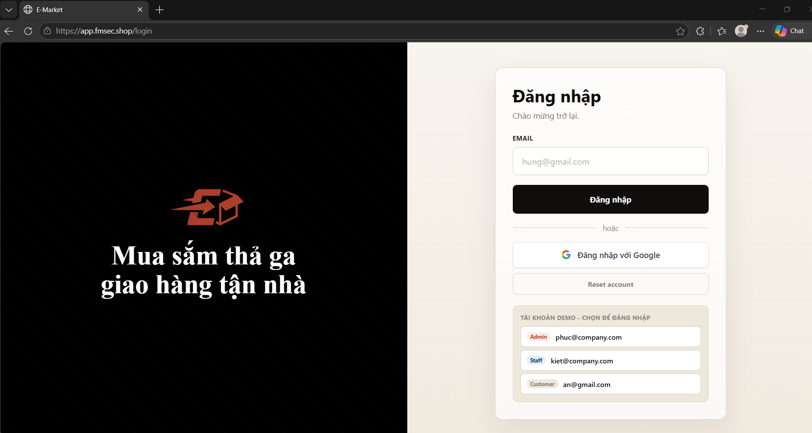
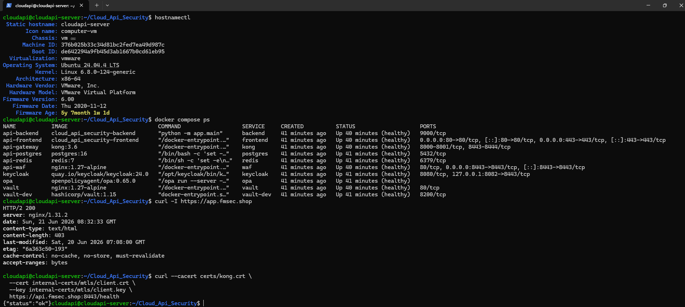
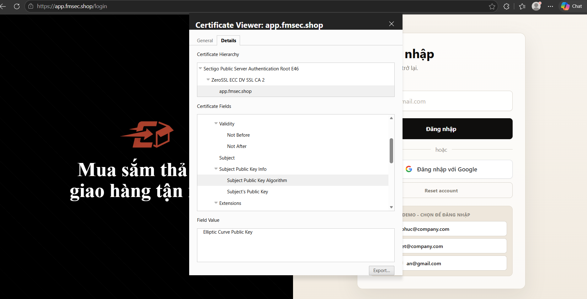
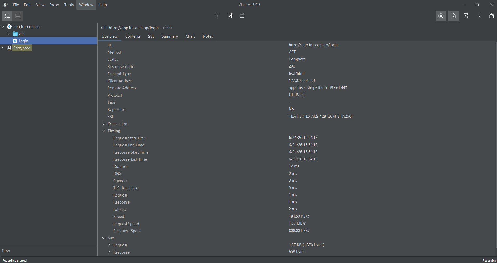

# NT219.Q21.ANTT - MẬT MÃ HỌC


**Tên đề tài:** Cloud API-Based Network Application Security for Small Company Services

Hệ thống API bảo mật đa tầng được xây dựng theo kiến trúc Zero-Trust, triển khai bằng Docker Compose. Dự án mô phỏng môi trường thương mại điện tử (users / products / orders) và tích hợp đầy đủ các cơ chế bảo mật API hiện đại: từ xác thực danh tính, phân quyền chính sách, mã hoá dữ liệu, cho đến giám sát bảo mật và kiểm thử tấn công.

---

## Mục lục
 
1. [Kiến trúc tổng quan](#1-kiến-trúc-tổng-quan)
2. [Thành phần hệ thống](#2-thành-phần-hệ-thống)
3. [Cơ chế bảo mật](#3-cơ-chế-bảo-mật)
4. [Rủi ro & Giải pháp](#4-rủi-ro--giải-pháp)
5. [Cấu trúc thư mục](#5-cấu-trúc-thư-mục)
6. [Yêu cầu hệ thống](#6-yêu-cầu-hệ-thống)
7. [Cài đặt ban đầu](#7-cài-đặt-ban-đầu)
8. [Chế độ Local HTTPS (Windows/Dev)](#8-chế-độ-local-https-windowsdev)
9. [Chế độ Server/Domain (Production)](#9-chế-độ-serverdomain-production)
10. [Các điểm truy cập](#10-các-điểm-truy-cập)
11. [Luồng xác thực (Auth Flow)](#11-luồng-xác-thực-auth-flow)
12. [Phân quyền & Vai trò](#12-phân-quyền--vai-trò)
13. [Kiểm thử bảo mật](#13-kiểm-thử-bảo-mật)
14. [Observability & Giám sát](#14-observability--giám-sát)
15. [CI/CD Pipeline đề xuất](#15-cicd-pipeline-đề-xuất)
16. [Scripts tiện ích](#16-scripts-tiện-ích)
17. [Authors](#authors)
18. [License](#license)
---
 
## 1. Kiến trúc tổng quan
 
Hệ thống được chia thành 7 tầng độc lập, giao tiếp qua các mạng Docker riêng biệt:
 
```
Internet
    │
    ▼
[Frontend – Nginx TLS]        ← HTTPS 443 / 80  (dmz-net)
    │
    ▼
[WAF – Nginx mTLS Proxy]      ← port 8443        (dmz-net)
    │  (mTLS client cert bắt buộc)
    ▼
[API Gateway – Kong 3.6]      ← TLS 1.3 only     (dmz-net / app-net)
    │  JWT Hardening · OPA Authz · Rate Limit · HSTS · CORS
    ▼
[Backend – FastAPI / Python]  ← HTTPS 9000       (app-net / data-net)
    │  BOLA Guard · SSRF Guard · TOTP · AEAD Encrypt
    │
    ├──▶ [Keycloak 24.0]   OIDC IdP             (app-net / dmz-net)
    ├──▶ [OPA 0.65.0]      Policy Engine         (app-net)
    ├──▶ [Redis 7 TLS]     Nonce / Session cache (app-net)
    ├──▶ [PostgreSQL 16 TLS+mTLS] Datastore      (data-net)
    └──▶ [Vault 1.15 + TLS Proxy] Secret / KEK  (data-net)
```
 
Toàn bộ traffic nội bộ giữa các service đều chạy qua TLS (TLS 1.3 ưu tiên). Frontend và WAF dùng certificate ZeroSSL công khai; các service nội bộ dùng CA nội bộ (`internal-certs/ca.crt`) tự sinh.
 
---
 
## 2. Thành phần hệ thống
 
| Service | Image | Vai trò | Mạng |
|---|---|---|---|
| `frontend` | Nginx + Vite/React | SPA – giao diện người dùng | `dmz-net` |
| `api-waf` | Nginx 1.27-alpine | WAF – mTLS proxy, lọc request | `dmz-net` |
| `api-gateway` | Kong 3.6 | API Gateway – JWT, Rate Limit, OPA | `dmz-net`, `app-net` |
| `keycloak` | Keycloak 24.0 | IdP – OIDC, realm management | `dmz-net`, `app-net` |
| `opa` | OPA 0.65.0 | Policy Engine – Rego authorization | `app-net` |
| `api-backend` | Python 3.12 / FastAPI | Business logic + security modules | `app-net`, `data-net` |
| `api-redis` | Redis 7 TLS | Cache/session runtime | `app-net` |
| `api-postgres` | PostgreSQL 16 TLS | Datastore chính | `data-net` |
| `vault` | Nginx TLS Proxy | Vault TLS endpoint | `data-net` |
| `vault-dev` | HashiCorp Vault 1.15 | KMS – Transit Engine (KEK) | `vault-backend-net` |
| `vault-init` | HashiCorp Vault 1.15 | One-shot init: enable Transit, wrap DEK | `data-net` |
| `loki` *(obs)* | Grafana Loki 2.9 | Log aggregation | `obs-net` |
| `promtail` *(obs)* | Grafana Promtail 2.9 | Log shipping | `obs-net`, `app-net` |
| `grafana` *(obs)* | Grafana 10.0 | Dashboard logs + metrics | `obs-net` |
| `prometheus` *(obs)* | Prometheus 2.53 | Metrics scrape & storage | `obs-net` |
| `cadvisor` *(obs)* | cAdvisor 0.49 | Container metrics | `obs-net` |
| `pgadmin` *(tools)* | pgAdmin 4 | DB admin tool | `data-net` |
 
---
 
## 3. Cơ chế bảo mật
 
### 3.1 Xác thực (Authentication)
 
**OIDC Authorization Code + PKCE** — Frontend khởi tạo PKCE flow (SHA-256 challenge), sau khi nhận `code` từ Keycloak thì gọi backend `/api/v1/auth/callback` để đổi lấy token. Backend xác thực token bằng JWKS của Keycloak (cache có TTL, tự refresh nếu `kid` không khớp), verify đầy đủ: chữ ký ES256, `exp`, `iss`, `aud`.
 
**TOTP (Time-based OTP)** — Keycloak realm yêu cầu tài khoản demo role `admin` và `staff` cấu hình TOTP ở lần đăng nhập đầu. Backend có endpoint setup/verify/reset TOTP trong `backend/app/api/v1/auth.py` và module `backend/app/security/totp_verify.py` dùng `pyotp` với window ±1 step để tolerate clock skew. Nếu muốn enforce TOTP trên mọi request quyền cao, middleware hoặc endpoint cần gọi `check_totp_required()` và kiểm tra header `X-TOTP-Code`.
 
**JWT Hardening (Kong plugin Lua)** — Plugin `jwt-hardening` tại Kong layer thực hiện pre-validation trước khi request đến backend: chặn token yếu như `alg: none`, lấy JWKS từ Keycloak, kiểm tra `kid`/claim thời gian và các claim OIDC quan trọng ở gateway. Backend vẫn verify lại độc lập bằng `jwt_verify.py` với ES256, `issuer` và `audience`, nên gateway là lớp chặn sớm còn backend là lớp xác thực cuối cùng.
 
### 3.2 Phân quyền (Authorization)
 
**OPA (Open Policy Agent)** — Kong gửi metadata request đến OPA (`https://opa:8181/v1/data/authz`) trước khi forward đến backend. Chính sách Rego trong `opa/policies/authz.rego` kiểm soát quyền truy cập theo role × method × path.
 
**RBAC tại Backend** — Module `backend/app/security/authorization.py` đọc `realm_access.roles` từ JWT payload đã verify và thực thi role-check ở từng endpoint bằng `require_roles()`.
 
**BOLA Guard** — `backend/app/security/bola_guard.py` chặn Broken Object Level Authorization: chỉ admin/staff mới đọc mọi đơn hàng, customer chỉ đọc đơn của chính mình (so sánh `order.user_id` với JWT `sub`).
 
### 3.3 Bảo mật đường truyền (Transport Security)
 
- **TLS/mTLS nội bộ** cho các kết nối quan trọng; WAF, Frontend Nginx và Kong được cấu hình TLS 1.3 ở edge.
- **mTLS** giữa WAF và Kong: Kong yêu cầu `ssl_verify_client: on` với CA nội bộ — chỉ WAF có client cert hợp lệ mới được forward request vào.
- **HSTS** được inject bởi plugin Kong `hsts-header` trên mọi response.
- **TLS verify chuỗi** tại Kong khi upstream đến Backend: `tls_verify: true`, `ca_certificates` chỉ định CA nội bộ.

### 3.4 Mã hoá dữ liệu (Data Encryption at Rest)
 
**Envelope Encryption với Vault Transit KEK:**
 
```
Vault Transit (KEK) ──wrap──▶  VAULT_WRAPPED_DEK (env var)
                                       │
                              backend ─┘ unwrap tại runtime
                                       ▼
                               DEK (AES-256) in memory
                                       │
                         AES-256-GCM encrypt/decrypt
                                       ▼
                             field nhạy cảm trong DB
```
 
Module `backend/app/security/aead_encryption.py` thực hiện AES-256-GCM với nonce 12 byte ngẫu nhiên. Output: `12B nonce || ciphertext || 16B GCM tag`. DEK được unwrap từ Vault Transit tại runtime và không persist trên disk. Trong project hiện tại, cơ chế này được dùng cho các field nhạy cảm trong dữ liệu seed/demo như email và phone; các field mới cần gọi `encrypt_field()` trước khi ghi DB nếu muốn được bảo vệ tương tự.
 
### 3.5 Bảo vệ tấn công (Attack Mitigation)
 
**SSRF Guard** — `backend/app/security/ssrf_guard.py` validate URL trước mọi outbound call: block scheme không phải http/https, hostname `localhost`, mọi IP private/loopback/link-local/multicast (bao gồm metadata endpoint `169.254.169.254`), resolve hostname và kiểm tra IP sau resolve.
 
**WAF Filtering** — Nginx WAF (`waf/nginx.conf`, `waf/nginx.local.conf`) đứng trước Kong, giới hạn kích thước request và chặn các pattern cơ bản như path traversal, SQL injection và XSS trước khi request đi sâu vào gateway/backend.
 
**Webhook HMAC** — Endpoint `POST /api/v1/orders/webhooks/orders` kiểm tra `X-Timestamp` và `X-Signature`, tính HMAC-SHA256 bằng `WEBHOOK_SECRET`, sau đó dùng `hmac.compare_digest()` để chống timing attack khi so sánh chữ ký.
 
**Rate Limiting** — Kong rate-limiting plugin: 100 request/phút/IP.
 
**CORS** — Production Kong chỉ whitelist `https://app.fmsec.shop`; local override thêm các origin localhost cần thiết cho dev. Backend cũng cấu hình CORS qua `BACKEND_CORS_ORIGINS` để giữ thêm một lớp kiểm soát ở application layer.
 
**Security Headers** — `X-Content-Type-Options: nosniff`, `X-Frame-Options: DENY` được inject qua Kong `response-transformer`; HSTS được inject qua plugin `hsts-header`.
 
---
 
## 4. Rủi ro & Giải pháp
 
Phần này trình bày các rủi ro bảo mật cụ thể mà hệ thống đối mặt, phân tích tại sao chúng nguy hiểm trong bối cảnh API, và mô tả các cơ chế đã được triển khai trong project hiện tại.
 
---
 
### 4.1 Broken Authentication — Token giả mạo & thuật toán yếu
 
**Rủi ro:** JWT hỗ trợ nhiều thuật toán, trong đó `alg: none` cho phép token không cần chữ ký vẫn được chấp nhận bởi các thư viện cũ hoặc cấu hình sai. Ngoài ra, HS256 (symmetric) yêu cầu backend giữ cùng secret với IdP — nếu secret lộ, kẻ tấn công có thể tự ký token hợp lệ. Rủi ro leo thang khi API nhận token từ nhiều client khác nhau.
 
**Tại sao nguy hiểm:** Một token giả mạo thành công bypass toàn bộ lớp xác thực, cho phép attacker giả danh bất kỳ user hoặc admin nào mà không cần password.
 
**Giải pháp đã chọn:** Keycloak realm cấu hình chữ ký token bằng **ES256**. Backend (`backend/app/security/jwt_verify.py`) lấy JWKS từ Keycloak, chọn public key theo `kid`, tự refresh cache nếu không tìm thấy key, và verify độc lập với `algorithms=["ES256"]`, `issuer` và `audience`. Ở gateway, plugin `jwt-hardening` thực hiện lớp kiểm tra sớm để chặn token yếu hoặc token không hợp lệ trước khi request đi sâu vào backend.
 
**Lý do không dùng HS256:** Với symmetric key, nếu backend bị compromise thì signing key cũng lộ — attacker có thể ký token bất kỳ. ES256 đảm bảo chỉ Keycloak có private key; ngay cả khi backend hoàn toàn bị chiếm, attacker vẫn không thể tạo token mới.
 
---
 
### 4.2 Broken Object Level Authorization (BOLA / IDOR)
 
**Rủi ro:** BOLA là lỗ hổng phổ biến nhất trong OWASP API Security Top 10. API nhận ID tài nguyên trực tiếp từ request (ví dụ `GET /api/v1/orders/42`) mà không kiểm tra liệu user hiện tại có quyền truy cập object đó hay không. Chỉ kiểm tra "đã đăng nhập" là không đủ — customer A có thể đọc đơn hàng của customer B bằng cách đoán ID.
 
**Tại sao nguy hiểm:** Trong hệ thống thương mại, đơn hàng chứa địa chỉ giao hàng, thông tin thanh toán, lịch sử mua hàng. BOLA cho phép liệt kê dữ liệu của toàn bộ user chỉ bằng cách increment ID.
 
**Giải pháp đã chọn:** Module `backend/app/security/bola_guard.py` implement hàm `can_read_order(order_owner_id, token_payload)` so sánh trực tiếp `order.user_id` với `sub` trong JWT payload. Logic tường minh: admin/staff được phép đọc tất cả; customer chỉ đọc đơn hàng mà `order.user_id == token.sub`. Endpoint `GET /api/v1/orders/{order_id}` gọi guard này trước khi trả dữ liệu.
 
**Lý do không dùng chỉ role-check:** Role-check (`require_roles`) chỉ trả lời "user có đúng vai trò không" — không trả lời "user có quyền trên object cụ thể này không". Cần kết hợp cả hai: role-check tại handler level + ownership-check tại service level.
 
---
 
### 4.3 Broken Function Level Authorization — Leo thang đặc quyền
 
**Rủi ro:** Kẻ tấn công tự sửa JWT payload (thêm role `admin` vào `realm_access.roles`) hoặc dùng token của staff để gọi endpoint chỉ dành cho admin. Nếu API chỉ kiểm tra xác thực mà không kiểm tra quyền theo từng endpoint, mọi user đã đăng nhập đều có thể gọi mọi chức năng.
 
**Tại sao nguy hiểm:** Trong môi trường thương mại, endpoint admin có thể xoá user, thay đổi giá sản phẩm, hoặc truy cập log hệ thống. Một staff leo thang lên admin nghĩa là breach toàn bộ hệ thống.
 
**Giải pháp đã chọn:** Hai tầng phân quyền hoạt động độc lập và bổ sung cho nhau. **Tầng 1 (OPA tại Kong):** Plugin `opa-authz` gửi metadata request đến OPA, policy `opa/policies/authz.rego` kiểm tra tổ hợp `role × method × path`. **Tầng 2 (Backend):** Hàm `require_roles(request, allowed_roles)` trong `backend/app/security/authorization.py` đọc roles từ JWT payload đã được verify chữ ký, không tin vào role tự gửi từ client. Các endpoint ghi dữ liệu như users/products/orders gọi `require_roles()` theo đúng role được phép.
 
**Lý do cần cả hai tầng:** OPA tại gateway giảm tải cho backend và block sớm; backend RBAC là lớp phòng thủ cuối cùng nếu Kong bị bypass hoặc misconfigure. Defense-in-depth không dựa vào điểm kiểm soát duy nhất.
 
---
 
### 4.4 Broken Authentication — Thiếu xác thực bước hai (MFA)
 
**Rủi ro:** Password đơn có thể bị brute-force, phishing, hoặc lộ qua data breach. Với tài khoản admin/staff có quyền cao, password-only authentication là điểm yếu nghiêm trọng — một lần mất mật khẩu là mất toàn bộ quyền kiểm soát hệ thống.
 
**Tại sao nguy hiểm:** Admin có thể xoá user, thay đổi cấu hình, truy cập log. Staff có thể sửa đơn hàng và giá sản phẩm. Không có MFA nghĩa là credential stuffing attack có thể thành công ngay lần đầu.
 
**Giải pháp đã chọn:** Project có cơ chế **TOTP** cho role `admin` và `staff`. Keycloak realm yêu cầu `CONFIGURE_TOTP` cho tài khoản demo quyền cao; backend có các endpoint setup/verify/reset TOTP trong `backend/app/api/v1/auth.py` và module kiểm tra mã trong `backend/app/security/totp_verify.py`. Hàm verify dùng `pyotp.TOTP.verify(code, valid_window=1)` để cho phép lệch thời gian nhỏ giữa client và server.
 
**Lưu ý triển khai hiện tại:** Module TOTP đã có, nhưng nếu muốn enforce bắt buộc `X-TOTP-Code` trên mọi request admin/staff thì cần đảm bảo middleware hoặc từng endpoint gọi `check_totp_required()`. `pyotp.verify()` không tự chặn reuse trong cùng time window; nếu cần chống replay strict thì nên lưu step/nonce đã dùng vào Redis.
 
**Lý do chọn TOTP thay vì SMS OTP:** TOTP không phụ thuộc vào carrier, không bị SIM-swapping, và hoạt động offline sau khi seed. SMS OTP có thể bị intercept qua SS7 vulnerability hoặc bị chiếm qua SIM swap.
 
---
 
### 4.5 Server-Side Request Forgery (SSRF)
 
**Rủi ro:** API có endpoint nhận URL từ user (webhook, product image URL, preview...). Nếu không validate, attacker có thể truyền vào `http://169.254.169.254/latest/meta-data/` (AWS metadata), `http://redis:6379`, hoặc `http://postgres:5432` để thăm dò và tấn công hạ tầng nội bộ từ bên trong container network.
 
**Tại sao nguy hiểm:** Cloud metadata endpoint thường chứa IAM credentials. Trong môi trường Docker, các service nội bộ như Redis, Postgres, Vault không có authentication ngoài mạng container — SSRF có thể đọc dữ liệu trực tiếp, thậm chí ghi vào Redis để poisoning cache hoặc session.
 
**Giải pháp đã chọn:** `backend/app/security/ssrf_guard.py` implement `validate_outbound_url(url)` với nhiều lớp kiểm tra tuần tự. Đầu tiên kiểm tra scheme (chỉ http/https), sau đó block hostname `localhost`. Tiếp theo parse IP trực tiếp nếu hostname là địa chỉ IP và kiểm tra các dải private/loopback/link-local/multicast/reserved. Quan trọng nhất: **resolve DNS rồi kiểm tra lại IP sau resolve** — phòng chống DNS rebinding attack. Endpoint `/api/v1/security/url-check` dùng guard này để tạo bằng chứng kiểm thử.
 
**Lý do cần kiểm tra sau DNS resolve:** Attacker có thể tạo domain `evil.com` ban đầu trỏ đến IP public để vượt whitelist, sau đó đổi DNS về `127.0.0.1`. Validate sau resolve loại bỏ toàn bộ vector này.
 
---
 
### 4.6 Thiếu mã hoá dữ liệu nhạy cảm tại rest
 
**Rủi ro:** Dữ liệu nhạy cảm như email, số điện thoại hoặc thông tin định danh nếu lưu plaintext trong database sẽ bị lộ ngay khi database, backup hoặc tài khoản DB bị compromise.
 
**Tại sao nguy hiểm:** Mã hoá ở tầng disk không bảo vệ trong trường hợp attacker có SQL access — họ vẫn đọc được dữ liệu qua query. Cần mã hoá tại tầng ứng dụng trước khi ghi field nhạy cảm vào DB.
 
**Giải pháp đã chọn:** Project có module **Envelope Encryption** trong `backend/app/security/aead_encryption.py`, kết hợp **AES-256-GCM** và **HashiCorp Vault Transit**. DEK 256-bit được wrap bởi KEK trong Vault Transit và truyền vào backend qua `VAULT_WRAPPED_DEK`; backend unwrap DEK qua HTTPS, giữ trong memory. Hàm `encrypt_field()` tạo nonce 12 byte random và lưu output dạng `nonce || ciphertext || GCM tag`; `decrypt_field()` sẽ lỗi nếu ciphertext bị chỉnh sửa. Trong dữ liệu seed/demo, các field như email và phone được mã hoá bằng module này.
 
**Lý do chọn AES-GCM thay vì AES-CBC:** GCM là AEAD — vừa mã hoá vừa xác thực tính toàn vẹn. CBC chỉ mã hoá, không authenticate, nếu dùng phải ghép thêm HMAC riêng. Vault Transit giúp tách KEK khỏi source code và hỗ trợ rotate KEK bằng script `vault/init/vault-rotate.sh`.
 
---
 
### 4.7 Thiếu bảo mật truyền tải — Man-in-the-Middle nội bộ
 
**Rủi ro:** Trong môi trường Docker, các container giao tiếp qua Docker network — traffic giữa Kong và Backend, giữa Backend và PostgreSQL thường là plaintext HTTP/TCP. Nếu một container bị compromise (supply chain attack, container escape), attacker có thể sniff toàn bộ traffic nội bộ bao gồm JWT, query SQL, DEK unwrap request.
 
**Tại sao nguy hiểm:** Mô hình "trust nội bộ" (plaintext inside perimeter) không còn phù hợp với kiến trúc container — ranh giới "bên trong" và "bên ngoài" không rõ ràng. Container escape hoặc malicious image có thể eavesdrop mọi service ngang hàng.
 
**Giải pháp đã chọn:** Project dùng TLS cho các kết nối quan trọng giữa service: PostgreSQL, Redis, Backend, OPA và Vault đều có certificate nội bộ; frontend/WAF/Kong dùng TLS ở edge. Kong verify certificate chain của backend khi upstream (`tls_verify: true`, `ca_certificates` chỉ định CA nội bộ). **mTLS** giữa WAF và Kong: Kong bật `ssl_verify_client: on`, chỉ client certificate hợp lệ do internal CA ký mới được kết nối.
 
**Lý do cần internal CA riêng:** Public CA không cấp cert cho hostname nội bộ như `api-backend`, `opa`, `redis`. Internal CA cho phép cấp cert theo Docker service name. Edge Nginx/Kong ép TLS 1.3; các service nội bộ dùng TLS và CA nội bộ, cần kiểm thử riêng nếu muốn chứng minh TLS 1.3-only cho mọi service.
 
---
 
### 4.8 Thiếu giới hạn tốc độ — Brute Force & DDoS
 
**Rủi ro:** Không có rate limiting cho phép attacker brute-force mật khẩu, TOTP code, hoặc đơn giản là flood API với request để làm sập service (application-level DoS). Các endpoint auth đặc biệt nhạy cảm — 6 chữ số TOTP có thể bị brute-force trong vài giây nếu không có throttle.
 
**Giải pháp đã chọn:** Kong `rate-limiting` plugin enforce 100 request/phút/IP ở gateway trước khi request đến backend. Limit áp dụng ở điểm vào API nên giảm tải cho backend và tạo bằng chứng dễ kiểm thử bằng DAST.
 
**Lưu ý:** Đây là rate limit toàn cục theo IP. Nếu muốn chống brute-force đăng nhập/TOTP mạnh hơn, nên bổ sung limit riêng cho auth endpoint và lockout theo user/session.
 
---
 
### 4.9 Thiếu kiểm soát nguồn gốc request — CORS & Header Injection
 
**Rủi ro:** Không giới hạn CORS cho phép trang web độc hại gọi API thay mặt user đã đăng nhập (CSRF qua CORS). Thiếu security header (`X-Frame-Options`, `X-Content-Type-Options`) cho phép clickjacking và MIME-sniffing attack.
 
**Giải pháp đã chọn:** Production Kong whitelist `https://app.fmsec.shop`; local override thêm các origin localhost cần thiết cho dev. Backend dùng FastAPI `CORSMiddleware` đọc `BACKEND_CORS_ORIGINS`. Kong `response-transformer` inject `X-Content-Type-Options: nosniff` và `X-Frame-Options: DENY`; plugin `hsts-header` inject `Strict-Transport-Security`.
 
**Lý do cấu hình song song:** CORS/header ở gateway giúp block sớm ở edge; backend CORS là lớp bổ sung khi chạy test nội bộ hoặc khi gateway cấu hình sai.
 
---
 
### 4.10 Webhook giả mạo & Timing Attack
 
**Rủi ro:** Webhook là endpoint public thường được gọi bởi hệ thống bên ngoài. Nếu không xác thực chữ ký, attacker có thể tự gửi payload giả để tạo đơn hàng, thay đổi trạng thái hoặc spam backend.
 
**Tại sao nguy hiểm:** Webhook thường được exempt khỏi auth user thông thường, nên nếu chỉ dựa vào URL bí mật thì attacker chỉ cần đoán hoặc leak endpoint là có thể gọi trực tiếp.
 
**Giải pháp đã chọn:** Endpoint `POST /api/v1/orders/webhooks/orders` kiểm tra `X-Timestamp` và `X-Signature`. Backend tính HMAC-SHA256 trên `timestamp.body` bằng `WEBHOOK_SECRET`, sau đó so sánh bằng `hmac.compare_digest()` để tránh timing attack.
 
**Lưu ý:** `WEBHOOK_SECRET` đang có default demo trong code; khi deploy thật cần set secret mạnh trong `.env` hoặc secret manager.
 
---
 
### 4.11 WAF bypass & request độc hại ở edge
 
**Rủi ro:** Nếu attacker gửi request trực tiếp đến gateway hoặc gửi payload chứa path traversal, SQLi/XSS pattern, request có thể đi sâu vào backend trước khi bị xử lý.
 
**Tại sao nguy hiểm:** Backend không nên là nơi đầu tiên nhìn thấy mọi payload độc hại. Chặn càng sớm càng giảm tải và giảm bề mặt tấn công.
 
**Giải pháp đã chọn:** WAF Nginx (`waf/nginx.conf`, `waf/nginx.local.conf`) đứng trước Kong, bật TLS, yêu cầu client certificate khi proxy vào Kong, giới hạn `client_max_body_size`, và có rule chặn pattern path traversal, SQL injection và XSS cơ bản. Kong cũng yêu cầu mTLS từ WAF nên request bên ngoài không thể gọi thẳng Kong nếu không có client cert hợp lệ.
 
---
 
## 5. Cấu trúc thư mục
 
```
Cloud_Api_Security/
├── backend/                    # FastAPI application
│   └── app/
│       ├── api/v1/             # auth, users, products, orders, security
│       ├── core/config.py      # Pydantic settings
│       ├── db/                 # SQLAlchemy models, seed data
│       ├── middleware/         # AuthMiddleware, LoggingMiddleware
│       └── security/           # jwt_verify, authorization, bola_guard, ssrf_guard, totp_verify, aead_encryption
├── frontend/
│   ├── nginx.conf              # Production nginx config
│   └── nginx.local.conf        # Local dev nginx config (override bởi docker-compose.local.yml)
├── gateway/
│   ├── kong.yml                # Production Kong declarative config
│   ├── kong.local.yml          # Local dev Kong config (ssl_verify off, localhost CORS)
│   └── plugins/                # jwt-hardening, opa-authz, hsts-header (Lua)
├── waf/
│   ├── nginx.conf              # Production WAF config
│   └── nginx.local.conf        # Local dev WAF config (proxy_ssl_verify off)
├── idp/keycloak/
│   └── realm-export.json       # Realm: clients, roles, PKCE, TOTP, Google IdP
├── opa/
│   ├── policies/               # authz.rego, admin.rego, rate_limit.rego
│   └── tests/                  # OPA unit tests
├── vault/
│   ├── init/                   # vault-init.sh, wrap-dek.sh, vault-rotate.sh
│   └── policies/dek-policy.hcl
├── observability/              # Grafana, Loki, Prometheus, Promtail configs
├── scripts/
│   ├── gen_certs.py            # Sinh internal-certs/ (dùng cho cả local + production)
│   ├── gen_local_certs.py      # Sinh certs-local/ (chỉ local, tạo CA + cert + bundle)
│   ├── attacks/                # Simulation: alg_none, bola, ssrf, role_escalation
│   ├── evaluation/             # TLS, TOTP, AEAD, rotation, policy, JWT hardening tests
│   └── security_testing/       # run_sast.py, run_dast.py
├── certs/                      # Public TLS certs — production only (ZeroSSL)
├── certs-local/                # Self-signed TLS certs — local only (gitignored)
├── internal-certs/             # Internal CA + service certs (dùng chung)
│   └── mtls/client.crt/.key   # Client cert cho WAF → Kong mTLS
├── .env                        # Production environment variables
├── .env.local                  # Local dev environment variables (gitignored)
├── docker-compose.yml          # Base orchestration (production)
└── docker-compose.local.yml    # Local dev override (cert, port, hostname, nginx, kong)
```
 
---
 
## 6. Yêu cầu hệ thống
 
| Phần mềm | Phiên bản tối thiểu |
|---|---|
| Docker Engine | 24.x trở lên |
| Docker Compose | v2.20 trở lên (plugin) |
| Python | 3.11+ (cho scripts ngoài container) |
| OpenSSL | Bất kỳ (có sẵn trên Windows/Linux/macOS) |
| RAM | 4 GB khuyến nghị (full stack) |
 
---
 
## 7. Cài đặt ban đầu
 
Các bước này thực hiện **một lần duy nhất**, dùng chung cho cả local lẫn production.
### Bước 1: Clone repo
 
```bash
git clone https://github.com/FUCLU/Cloud_API_Security.git
cd Cloud_Api_Security
```
 
### Bước 2: Sinh internal certificates
 
Internal certs dùng cho tất cả service nội bộ (postgres, redis, vault, opa, backend) và mTLS client cert cho WAF → Kong:
 
```bash
python scripts/gen_certs.py
```
 
Kết quả trong `internal-certs/`:
 
```
internal-certs/
  ca.crt / ca.key          ← Internal CA
  backend.crt / .key
  opa.crt / .key
  postgres.crt / .key
  redis.crt / .key
  vault.crt / .key
  mtls/
    client.crt / .key      ← WAF dùng để kết nối Kong (mTLS)
```
 
Tiếp theo chọn chế độ chạy tại [Mục 8](#8-chế-độ-local-https-windowsdev) (local) hoặc [Mục 9](#9-chế-độ-serverdomain-production) (production).
 
---
 
## 8. Chế độ Local HTTPS (Windows/Dev)
 
Chế độ này chạy toàn bộ hệ thống trên máy cá nhân với HTTPS thật dùng self-signed certificate. Không cần domain thật, không cần sửa hosts file.
 
**URLs:**
 
| Service | URL |
|---|---|
| Frontend | `https://localhost:9444` |
| API (qua WAF) | `https://localhost:9443` |
| Keycloak Admin | `https://localhost:8082` |
 
### 8.1 Sinh certificate local
 
Script dùng OpenSSL để tạo Local CA, cert với SAN đầy đủ, và CA bundle cho backend:
 
```powershell
python scripts/gen_local_certs.py
```
 
Kết quả trong `certs-local/`:
 
```
certs-local/
  ca.crt / ca.key       ← Local CA (cần import vào Windows)
  localhost.crt / .key  ← Cert với SAN: localhost, keycloak, api-backend,
                          api-gateway, api-waf, 127.0.0.1, ::1
  ca-bundle.crt         ← ca.crt + internal-certs/ca.crt
                          (backend dùng để trust cả Keycloak lẫn Postgres/Redis)
```
 
> `certs-local/` đã có trong `.gitignore` — không bao giờ commit lên repo.
 
### 8.2 Import CA vào Windows
 
Mở **PowerShell với quyền Administrator**:
 
```powershell
certutil -addstore -f "ROOT" certs-local\ca.crt
```
 
Output thành công:
 
```
ROOT "Trusted Root Certification Authorities"
Certificate "LocalDev-CA" added to store.
CertUtil: -addstore command completed successfully.
```
 
Sau đó **restart browser** để nhận CA mới. Từ lần này browser sẽ trust `https://localhost:9444` và `https://localhost:8082` mà không có cảnh báo.
 
### 8.3 Tạo file .env.local
 
```dotenv
# .env.local — Local dev only, gitignored
 
# Database
POSTGRES_USER=apiuser
POSTGRES_PASSWORD=ApiDb2026_Demo!
POSTGRES_DB=apidb
POSTGRES_PORT=5434
 
# Redis 
REDIS_PORT=6380
 
# Vault
VAULT_TOKEN=VaultRoot@2026_Demo_ChangeMe!
VAULT_KEY_NAME=orders-dek
VAULT_WRAPPED_DEK=
 
# Keycloak 
KEYCLOAK_ADMIN=admin
KEYCLOAK_ADMIN_PASSWORD=Keycloak@2026_Demo!
KEYCLOAK_CLIENT_ID=spa-client
KEYCLOAK_CLIENT_SECRET=<your-keycloak-client-secret>
KEYCLOAK_REALM=cloudapi
JWT_AUDIENCE=account
 
# Local: Keycloak hostname = localhost, backend gọi qua container name
KC_HOSTNAME=localhost
KEYCLOAK_URL=https://keycloak:8443
KEYCLOAK_PUBLIC_URL=https://localhost:8082
JWT_ISSUER=https://localhost:8082/realms/cloudapi
 
# Frontend build args
VITE_REALM=cloudapi
VITE_CLIENT_ID=spa-client
VITE_KEYCLOAK_URL=https://localhost:8082
VITE_KONG_URL=https://localhost:9444/api
 
# Ports 
# WAF chiếm 9443 (edge), Frontend ở 9444 (không conflict)
FRONTEND_HTTPS_PORT=9444
FRONTEND_HTTP_PORT=9080
 
# URLs 
BACKEND_CORS_ORIGINS=https://localhost:9444
PUBLIC_BASE_URL=https://localhost:9444
FRONTEND_URL=https://localhost:9444
 
# Observability 
GRAFANA_USER=admin
GRAFANA_PASSWORD=Grafana2026_Demo!
PROMTAIL_LOG_LEVEL=info
PGADMIN_EMAIL=admin@example.com
PGADMIN_PASSWORD=PgAdmin2026_Demo!
```
 
### 8.4 Khởi chạy
 
```powershell
docker compose -f docker-compose.yml -f docker-compose.local.yml --env-file .env.local up -d --build
```
 
### 8.5 Kiểm tra port mapping
 
```powershell
docker compose -f docker-compose.yml -f docker-compose.local.yml --env-file .env.local ps
```
 
Kết quả đúng:
 
```
api-waf        ...  0.0.0.0:9443->8443/tcp    ← WAF edge tại 9443
api-frontend   ...  0.0.0.0:9444->443/tcp     ← Frontend tại 9444 (không conflict)
keycloak       ...  127.0.0.1:8082->8443/tcp  ← Keycloak tại 8082
```
 
### 8.6 Cấu hình Google OAuth (tùy chọn)
 
**Bước 1:** Trong Google Cloud Console, thêm redirect URI cho local:
 
```
https://localhost:8082/realms/cloudapi/broker/google/endpoint
```
 
**Bước 2:** Sau khi stack chạy, inject credentials vào Keycloak:
 
```powershell
docker exec keycloak sh -lc "
  keytool -import -noprompt -trustcacerts \
    -alias localdev-ca \
    -file /run/secrets/auth_tls_cert \
    -keystore /tmp/truststore.jks \
    -storepass changeit 2>/dev/null;
  /opt/keycloak/bin/kcadm.sh config credentials \
    --server https://localhost:8443 \
    --realm master \
    --user admin \
    --password 'Keycloak@2026_Demo!' \
    --config /tmp/kcadm.config \
    --truststore /tmp/truststore.jks \
    --trustpass changeit &&
  /opt/keycloak/bin/kcadm.sh update identity-provider/instances/google \
    -r cloudapi \
    --config /tmp/kcadm.config \
    --truststore /tmp/truststore.jks \
    --trustpass changeit \
    -s config.clientId=<GOOGLE_CLIENT_ID> \
    -s config.clientSecret=<GOOGLE_CLIENT_SECRET> \
    -s enabled=true &&
  echo 'Done OK'
"
```
 
**Bước 3:** Trong Keycloak Admin Console (`https://localhost:8082`), thêm vào client `spa-client`:
- Valid redirect URIs: `https://localhost:9444/*`
- Web origins: `https://localhost:9444`
### 8.7 Sơ đồ certificate local
 
```
certs-local/ca.crt  (Local CA)
    └── ký certs-local/localhost.crt
            ├── Keycloak    → /run/secrets/auth_tls_cert
            ├── Kong        → /run/secrets/kong_tls_cert
            ├── WAF         → /run/secrets/kong_tls_cert
            ├── Frontend    → /run/secrets/app_tls_cert
            └── Backend     → /run/secrets/backend_tls_cert
 
internal-certs/ca.crt  (Internal CA)
    ├── ký postgres.crt, redis.crt, vault.crt, opa.crt
    └── ký mtls/client.crt  → WAF gửi khi kết nối Kong
 
certs-local/ca-bundle.crt = Local CA + Internal CA
    └── Backend dùng (KEYCLOAK_CA_CERT_PATH, REQUESTS_CA_BUNDLE)
        để verify cả Keycloak (Local CA) lẫn Postgres/Redis (Internal CA)
```
 
### 8.8 Dừng hệ thống local
 
```powershell
# Dừng, giữ volumes (giữ Keycloak config, DB data)
docker compose -f docker-compose.yml -f docker-compose.local.yml --env-file .env.local down
 
# Dừng và xóa toàn bộ data (reset sạch)
docker compose -f docker-compose.yml -f docker-compose.local.yml --env-file .env.local down -v
```
 
---
 
## 9. Chế độ Server/Domain (Production)
 
Chế độ này dùng khi deploy lên Ubuntu server với domain thật và certificate ZeroSSL/Let's Encrypt.
 
**URLs:**
 
| Service | URL |
|---|---|
| Frontend | `https://app.fmsec.shop` |
| Keycloak Admin | `https://auth.fmsec.shop` |
| API qua WAF/Kong | `https://api.fmsec.shop:8443` |
 
### 9.1 Chuẩn bị server Ubuntu
 
Cài Docker Engine và Docker Compose plugin. Mở ports:
 
```
80/tcp, 443/tcp   → Frontend + Keycloak (qua Nginx nếu dùng D2)
8443/tcp          → API qua WAF/Kong
```
 
Các port quản trị (Grafana 3000, Prometheus 9091, pgAdmin 5050) chỉ bind `127.0.0.1` — truy cập qua SSH tunnel.

### 9.1.1 Copy code lên server

Có 2 cách khuyến nghị để đưa source code lên server Ubuntu.

**Cách 1 — Clone trực tiếp từ GitHub:**

```bash
cd ~
git clone https://github.com/FUCLU/Cloud_API_Security.git Cloud_Api_Security
cd Cloud_Api_Security
```

Nếu repository là private, cấu hình SSH key hoặc GitHub token trước khi clone.

**Cách 2 — Copy chọn lọc từ máy local lên server bằng `scp`:**

Trước tiên tạo thư mục project trên server:

```bash
ssh <USER>@<SERVER_PUBLIC_IP> "mkdir -p ~/Cloud_Api_Security"
```

Sau đó chạy trên máy local tại thư mục cha của project:

```bash
scp docker-compose.yml docker-compose.local.yml package.json package-lock.json \
  <USER>@<SERVER_PUBLIC_IP>:~/Cloud_Api_Security/

scp -r backend frontend gateway waf idp opa vault observability scripts tests \
  <USER>@<SERVER_PUBLIC_IP>:~/Cloud_Api_Security/
```

Nếu dùng kịch bản deploy D2, copy thêm thư mục `DEPLOY`:

```bash
scp -r DEPLOY <USER>@<SERVER_PUBLIC_IP>:~/Cloud_Api_Security/
```

Nếu muốn dùng `rsync` thay `scp`, có thể đồng bộ chọn lọc và bỏ qua các thư mục không cần thiết:

```bash
rsync -av --exclude ".git" --exclude "node_modules" --exclude "frontend/node_modules" \
  --exclude "certs-local" --exclude ".env.local" --exclude "EVIDENCE" \
  Cloud_Api_Security/ <USER>@<SERVER_PUBLIC_IP>:~/Cloud_Api_Security/
```

**Các thư mục/file nên có trên server production:**

- `backend/`
- `frontend/`
- `gateway/`
- `waf/`
- `idp/`
- `opa/`
- `vault/`
- `observability/`
- `scripts/`
- `tests/` nếu muốn chạy integration/security test trên server
- `DEPLOY/` nếu dùng runbook D1/D2 hoặc firewall script
- `docker-compose.yml`
- `package.json`, `package-lock.json` nếu cần giữ metadata Node ở root

**Không nên copy lên server production:**

- `.git/` nếu chỉ deploy source code, không cần lịch sử Git
- `node_modules/`
- `frontend/node_modules/`
- `certs-local/`
- `.env.local`
- `EVIDENCE/`
- file log hoặc output scan có token/cookie

Trên server production, tự tạo file `.env`, đặt certificate thật vào `certs/`, sinh lại `internal-certs/` nếu cần, rồi chạy Docker Compose theo các bước bên dưới.

### 9.1.2 Cấp quyền script và chuẩn bị file runtime

Sau khi copy code, SSH vào server và cấp quyền chạy cho các script `.sh`:

```bash
cd ~/Cloud_Api_Security
chmod +x scripts/*.sh scripts/evaluation/*.sh scripts/security_testing/*.sh \
  vault/init/*.sh

# Chỉ chạy nếu có copy thư mục DEPLOY
chmod +x DEPLOY/D2/*.sh
```

Nếu chưa có file certificate production, tạo thư mục trước để đặt cert:

```bash
mkdir -p certs internal-certs internal-certs/mtls
```

Nếu dùng volume Keycloak external trong production, tạo volume trước lần chạy đầu:

```bash
docker volume create cloud_api_security_keycloak_data
```

Nếu DNS public chưa trỏ xong và cần test tạm từ một máy client, thêm các dòng sau vào file `hosts` trên máy client:

```text
<SERVER_PUBLIC_IP>  app.fmsec.shop
<SERVER_PUBLIC_IP>  api.fmsec.shop
<SERVER_PUBLIC_IP>  auth.fmsec.shop
```

Vị trí file `hosts`:

- Windows: `C:\Windows\System32\drivers\etc\hosts`
- Linux/macOS: `/etc/hosts`
 
### 9.2 Cấu hình DNS
 
Trỏ 3 record A về server:
 
```
app.fmsec.shop   →  <SERVER_PUBLIC_IP>
api.fmsec.shop   →  <SERVER_PUBLIC_IP>
auth.fmsec.shop  →  <SERVER_PUBLIC_IP>
```
 
### 9.3 Sinh certificates production
 
**Internal certs** (nếu chưa có từ Mục 7):
 
```bash
python scripts/gen_certs.py
```
 
**Public certs** — Lấy từ ZeroSSL hoặc Let's Encrypt cho 3 domain và đặt vào `certs/`:
 
```
certs/
  app.crt / app.key    ← app.fmsec.shop  (frontend)
  auth.crt / auth.key  ← auth.fmsec.shop (keycloak)
  kong.crt / kong.key  ← api.fmsec.shop  (kong + waf)
```
 
### 9.4 Tạo file .env cho production
 
```dotenv
# .env — Production, KHÔNG commit lên repo
 
# Database 
POSTGRES_USER=apiuser
POSTGRES_PASSWORD=<strong-password>
POSTGRES_DB=apidb
 
# Vault
VAULT_TOKEN=<vault-root-token>
VAULT_KEY_NAME=orders-dek
VAULT_WRAPPED_DEK=<sinh sau khi vault-init chạy>
 
# Keycloak
KEYCLOAK_ADMIN=admin
KEYCLOAK_ADMIN_PASSWORD=<strong-password>
KEYCLOAK_CLIENT_ID=spa-client
KEYCLOAK_CLIENT_SECRET=<keycloak-client-secret>
KEYCLOAK_REALM=cloudapi
KC_HOSTNAME=auth.fmsec.shop
JWT_AUDIENCE=account
 
KEYCLOAK_URL=https://auth.fmsec.shop:8443
KEYCLOAK_PUBLIC_URL=https://auth.fmsec.shop
JWT_ISSUER=https://auth.fmsec.shop/realms/cloudapi
 
# Frontend 
VITE_REALM=cloudapi
VITE_CLIENT_ID=spa-client
VITE_KEYCLOAK_URL=https://auth.fmsec.shop
VITE_KONG_URL=https://api.fmsec.shop:8443
 
FRONTEND_HTTP_PORT=80
FRONTEND_HTTPS_PORT=443
FRONTEND_URL=https://app.fmsec.shop
PUBLIC_BASE_URL=https://app.fmsec.shop
BACKEND_CORS_ORIGINS=https://app.fmsec.shop
 
# Observability 
GRAFANA_USER=admin
GRAFANA_PASSWORD=<strong-password>
PGADMIN_EMAIL=admin@example.com
PGADMIN_PASSWORD=<strong-password>
```
 
### 9.5 Cấu hình Google OAuth cho production
 
Trong Google Cloud Console, thêm redirect URI production:
 
```
https://auth.fmsec.shop/realms/cloudapi/broker/google/endpoint
```
 
Sau khi stack chạy, cập nhật credentials vào Keycloak qua Admin Console (`https://auth.fmsec.shop`) hoặc qua kcadm.sh trên server.
 
### 9.6 Khởi chạy
 
```bash
cd ~/Cloud_Api_Security
 
# Không dùng docker-compose.local.yml trên server
docker compose up -d --build
docker compose ps
```
 
### 9.7 Sinh VAULT_WRAPPED_DEK
 
```bash
# Vault-init chạy tự động khi stack start
# Lấy giá trị VAULT_WRAPPED_DEK
docker exec vault-dev sh /vault/init/wrap-dek.sh
 
# Cập nhật .env và restart backend
echo "VAULT_WRAPPED_DEK=<value>" >> .env
docker compose up -d --force-recreate backend
```
 
### 9.8 Kiểm tra sau deploy
 
```bash
# Frontend
curl -I https://app.fmsec.shop
 
# Keycloak OIDC discovery
curl https://auth.fmsec.shop/realms/cloudapi/.well-known/openid-configuration | python3 -m json.tool
 
# API qua WAF/Kong với mTLS
curl --cacert certs/kong.crt \
  --cert internal-certs/mtls/client.crt \
  --key internal-certs/mtls/client.key \
  https://api.fmsec.shop:8443/health
 
# DAST đầy đủ
python3 scripts/security_testing/run_dast.py \
  --frontend-url https://app.fmsec.shop \
  --api-url https://api.fmsec.shop:8443 \
  --strict
```
 
### 9.9 Minh chứng triển khai và TLS

Ảnh dưới đây minh chứng server Ubuntu đã triển khai thành công, container đang chạy và API health check hoạt động qua WAF/Kong:



Ảnh dưới đây minh chứng website `https://app.fmsec.shop` sử dụng certificate hợp lệ cho domain:



Ảnh dưới đây minh chứng traffic HTTPS sử dụng giao thức TLS 1.3 khi quan sát bằng Charles Proxy:



 
### 9.10 Lưu ý quan trọng
 
**Không chạy `docker compose down -v`** sau khi Keycloak đã được cấu hình — lệnh này xóa volume và làm mất toàn bộ realm data. Khi cần restart bình thường:
 
```bash
docker compose restart keycloak
# hoặc
docker compose up -d --build  # rebuild image, giữ volumes
```
 
Vault dev mode không dùng cho production thật — thay bằng Vault production cluster có storage backend bền vững.
 
---
 
## 10. Các điểm truy cập
 
### Local HTTPS

| Dịch vụ | URL | Ghi chú |
|---|---|---|
| Frontend (SPA) | `https://localhost:9444` | Giao diện chính khi chạy local |
| Keycloak Admin | `https://localhost:8082` | Admin console local |
| API qua frontend proxy | `https://localhost:9444/api` | URL frontend gọi API; Nginx frontend proxy sang WAF/Kong |
| API edge qua WAF | `https://localhost:9443` | Gọi trực tiếp WAF edge khi test API/mTLS |
| Grafana | `http://localhost:3000` | Chỉ có khi chạy profile `obs` |
| Prometheus | `http://localhost:9091` | Chỉ có khi chạy profile `obs` |
| pgAdmin | `http://localhost:5050` | Chỉ có khi chạy profile `tools` |

### Server/domain

| Dịch vụ | URL | Ghi chú |
|---|---|---|
| Frontend (SPA) | `https://app.fmsec.shop` | HTTPS, port 443 |
| Keycloak Admin | `https://auth.fmsec.shop` | Admin console qua domain |
| Keycloak nội bộ | `https://localhost:8082` | Port loopback trên server nếu cần thao tác trực tiếp qua SSH/server shell |
| Keycloak OIDC | `https://auth.fmsec.shop/realms/cloudapi` | OIDC endpoints |
| API qua WAF/Kong | `https://api.fmsec.shop:8443` | mTLS required |
| Grafana | `http://localhost:3000` | Chạy trên server với profile `obs` |
| Prometheus | `http://localhost:9091` | Chạy trên server với profile `obs` |
| pgAdmin | `http://localhost:5050` | Chạy trên server với profile `tools` |
 
---
 
## 11. Luồng xác thực (Auth Flow)
 
```
User
 │
 ▼ (1) Truy cập app.fmsec.shop
Frontend
 │
 ▼ (2) Redirect đến Keycloak với PKCE code_challenge (S256)
 │     Params: response_type=code, code_challenge, code_challenge_method=S256
Keycloak
 │
 ▼ (3) User đăng nhập (+ TOTP nếu là admin/staff)
 │
 ▼ (4) Keycloak redirect về /callback với authorization code
Frontend
 │
 ▼ (5) POST /api/v1/auth/callback { code, code_verifier, redirect_uri }
Backend
 │
 ▼ (6) Exchange code → access_token + refresh_token (verify PKCE)
 │
 ▼ (7) Return token, set HttpOnly cookie
 │
 ▼ (8) Request tiếp theo dùng HttpOnly cookie hoặc Authorization header
 │     + X-TOTP-Code nếu endpoint quyền cao enforce TOTP
 │
Kong (JWT Hardening plugin)
 │ ├── Reject alg:none
 │ ├── Kiểm tra kid/JWKS và claim thời gian
 │ └── Validate các claim OIDC quan trọng
 │
OPA (opa-authz plugin)
 │ └── Check role × method × path
 │
Backend
 │ ├── jwt_verify.py: JWKS decode, ES256 verify
 │ ├── totp_verify.py: module setup/verify TOTP cho admin/staff
 │ ├── bola_guard.py: Object-level ownership check
 │ └── Business logic
```
 
---
 
## 12. Phân quyền & Vai trò
 
Hệ thống có 3 role chính, định nghĩa trong Keycloak realm và enforce song song tại OPA (gateway) và backend:
 
| Role | Quyền truy cập |
|---|---|
| `admin` | Toàn quyền: đọc/ghi users, products, orders; system settings; attack simulation |
| `staff` | GET tất cả `/api/v1/*`; POST/PUT products; POST/PUT orders |
| `customer` | GET products; GET/POST orders của chính mình |

#### Tài khoản demo

Các tài khoản demo được import từ `idp/keycloak/realm-export.json` khi Keycloak khởi tạo realm `cloudapi`.

| Email / Username | Mật khẩu | Role | Ghi chú |
|---|---|---|---|
| `phuc@company.com` | `demo1234` | `admin` | Bắt buộc cấu hình TOTP ở lần đăng nhập đầu |
| `hung@company.com` | `demo1234` | `admin` | Bắt buộc cấu hình TOTP ở lần đăng nhập đầu |
| `kiet@company.com` | `demo1234` | `staff` | Bắt buộc cấu hình TOTP ở lần đăng nhập đầu |
| `an@gmail.com` | `demo1234` | `customer` | Không yêu cầu TOTP |
| `bich@gmail.com` | `demo1234` | `customer` | Không yêu cầu TOTP |

Với tài khoản `admin` và `staff`, sau khi đăng nhập lần đầu Keycloak sẽ yêu cầu quét QR bằng ứng dụng Authenticator để tạo mã TOTP 6 chữ số. Các request API dành cho `admin/staff` cần gửi thêm header `X-TOTP-Code`.

Nếu cần reset TOTP cho tài khoản demo, dùng endpoint:

```http
POST /api/v1/auth/totp/reset-demo
Content-Type: application/json

{
  "email": "phuc@company.com"
}
```
 
**Nguyên tắc phân quyền:**
- OPA enforce tại gateway theo `role × method × path`.
- Backend RBAC enforce lại tại handler level (`require_roles()`).
- BOLA guard enforce tại service level theo `order.user_id == token.sub`.
 
---
 
## 13. Kiểm thử bảo mật
 
### SAST/SCA
 
```bash
python scripts/security_testing/run_sast.py
python scripts/security_testing/run_sast.py --strict  # Fail nếu có HIGH finding
```
 
### DAST
 
```bash
# Local
python scripts/security_testing/run_dast.py \
  --frontend-url https://localhost:9444 \
  --api-url https://localhost:9443 --strict
 
# Production
python3 scripts/security_testing/run_dast.py \
  --frontend-url https://app.fmsec.shop \
  --api-url https://api.fmsec.shop:8443 --strict
```
 
### Scripts tấn công mô phỏng
 
| Script | Tấn công | Kết quả mong đợi |
|---|---|---|
| `attacks/alg_none_attack.py` | JWT `alg: none` | `401` — Kong block |
| `attacks/bola_attack.py` | Đọc đơn hàng user khác | `403` — BOLA guard block |
| `attacks/ssrf_attack.py` | SSRF qua IP nội bộ | `400/403` — SSRF guard block |
| `attacks/role_escalation_test.py` | Tự thêm role admin | `401/403` — JWT verify / OPA block |
 
### OPA Policy Tests
 
```bash
docker compose exec -T opa opa test /tests/ -v
```
 
---
 
## 14. Observability & Giám sát
 
```bash
# Local
docker compose -f docker-compose.yml -f docker-compose.local.yml --env-file .env.local --profile obs up -d
 
# Production
docker compose --profile obs up -d
```
 
- **Grafana** `http://localhost:3000` — dashboard logs (Loki) và metrics (Prometheus + cAdvisor)
- **Security Alerts** `observability/loki/rules/security-alerts.yml` — alert cho auth failure, rate limit, SSRF attempt
---
 
## 15. CI/CD Pipeline đề xuất
 
### CI — SAST & Secrets Scan
 
Khi bổ sung workflow CI, nên kích hoạt trên push/PR vào `main` hoặc `dev`. Pipeline khuyến nghị chạy Bandit (SAST), pip-audit (SCA), detect-secrets và upload artifact `sast-security-evidence`.
 
### Release — DAST ZAP Scan
 
Khi bổ sung workflow release, nên kích hoạt trên push vào `main`. Pipeline khuyến nghị build frontend → Vite preview → ZAP baseline → upload artifact `dast-security-evidence`.
 
> CI chỉ smoke test frontend. Full DAST với WAF/Kong/mTLS/JWT/OPA phải chạy trên local HTTPS hoặc server/domain.
 
---
 
## 16. Scripts tiện ích
 
| Script | Mô tả |
|---|---|
| `scripts/gen_local_certs.py` | Sinh `certs-local/` cho local dev: Local CA, localhost cert (SAN đầy đủ), ca-bundle |
| `scripts/gen_certs.py` | Sinh `internal-certs/` cho tất cả service nội bộ và mTLS client cert |
| `scripts/reset_keycloak_demo_otp.sh` | Reset TOTP seed cho tài khoản demo |
| `vault/init/vault-init.sh` | Init Vault Transit engine |
| `vault/init/vault-rotate.sh` | Rotate KEK |
| `vault/init/wrap-dek.sh` | Wrap DEK, in ra `VAULT_WRAPPED_DEK` |
| `scripts/evaluation/e_c1_tls_capture.sh` | Kiểm tra TLS handshake |
| `scripts/evaluation/e_n1_totp_test.py` | Test TOTP enforce |
| `scripts/evaluation/e_c3_aead_integrity.py` | Test AEAD encrypt/decrypt + tamper detection |
| `scripts/evaluation/e_x1_rotation_test.sh` | Test Vault key rotation |
| `scripts/evaluation/e_z1_policy_test.sh` | Test OPA policy |
| `scripts/evaluation/e_z2_token_hardening.sh` | Test JWT hardening |
 
---
 
## Tổng hợp biến môi trường theo môi trường
 
| Biến | Local (`.env.local`) | Production (`.env`) |
|---|---|---|
| `KC_HOSTNAME` | `localhost` | `auth.fmsec.shop` |
| `KEYCLOAK_URL` | `https://keycloak:8443` | `https://auth.fmsec.shop:8443` |
| `KEYCLOAK_PUBLIC_URL` | `https://localhost:8082` | `https://auth.fmsec.shop` |
| `JWT_ISSUER` | `https://localhost:8082/realms/cloudapi` | `https://auth.fmsec.shop/realms/cloudapi` |
| `VITE_KEYCLOAK_URL` | `https://localhost:8082` | `https://auth.fmsec.shop` |
| `VITE_KONG_URL` | `https://localhost:9444/api` | `https://api.fmsec.shop:8443` |
| `FRONTEND_HTTPS_PORT` | `9444` | `443` |
| `FRONTEND_HTTP_PORT` | `9080` | `80` |
| `FRONTEND_URL` | `https://localhost:9444` | `https://app.fmsec.shop` |
| `BACKEND_CORS_ORIGINS` | `https://localhost:9444` | `https://app.fmsec.shop` |

---

## Authors

Project được thực hiện bởi nhóm sinh viên:

- **Lưu Hồng Phúc** — Nhóm trưởng
- **Phan Thái Hưng** — Thành viên
- **Võ Tưởng Tuấn Kiệt** — Thành viên

## License

Copyright © 2026 Lưu Hồng Phúc, Phan Thái Hưng, Võ Tưởng Tuấn Kiệt.

Dự án này được phát triển phục vụ mục đích học tập, nghiên cứu và đánh giá bảo mật trong khuôn khổ môn **NT219.Q21.ANTT — Mật mã học**.

Toàn bộ mã nguồn, tài liệu, cấu hình triển khai, hình ảnh minh chứng và bằng chứng kiểm thử trong repository này thuộc quyền sở hữu của nhóm tác giả. Không được sao chép, phân phối, chỉnh sửa, sử dụng cho mục đích thương mại hoặc triển khai production thật khi chưa có sự đồng ý bằng văn bản của nhóm tác giả.

Các thư viện, framework, container image và công cụ mã nguồn mở được sử dụng trong project vẫn tuân theo license gốc của từng dự án tương ứng.
