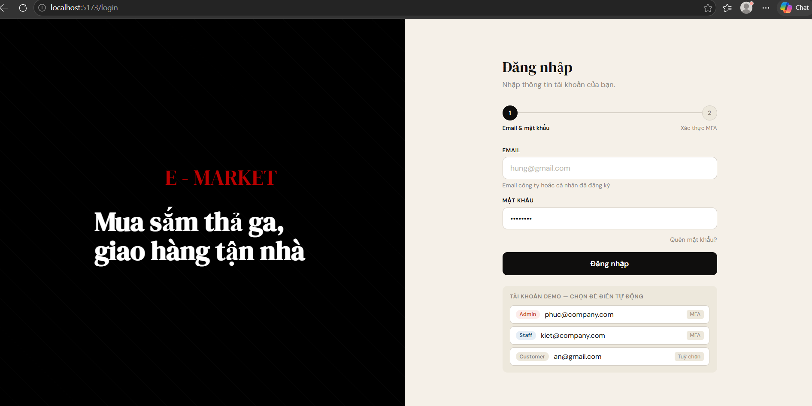

# NT219.Q21.ANTT - MẬT MÃ HỌC


**Tên đề tài:** Cloud API-Based Network Application Security for Small Company Services

## Mục lục
- [Tổng quan](#tổng-quan)
- [Kiến trúc hệ thống](#kiến-trúc-hệ-thống)
- [Giải pháp mật mã 3 lớp](#giải-pháp-mật-mã-3-lớp)
- [Invariants hệ thống](#invariants-hệ-thống)
- [Cấu trúc thư mục](#cấu-trúc-thư-mục)
- [Yêu cầu hệ thống](#yêu-cầu-hệ-thống)
- [Quick Start](#-quick-start)
- [Hướng dẫn Frontend](#-hướng-dẫn-frontend)
- [Địa chỉ truy cập](#địa-chỉ-truy-cập-sau-khi-stack-chạy)
- [Xác thực và gọi API](#lấy-token-và-gọi-api-có-auth)
- [Chạy kiểm thử](#chạy-kiểm-thử)
- [Triển khai D2 — Linux VM + mTLS](#triển-khai-d2--linux-vm--mtls)
- [CI/CD & Bảo mật supply chain](#cicd--bảo-mật-supply-chain)
- [Phân công](#phân-công)
- [Lưu ý bảo mật](#lưu-ý-bảo-mật)

---

## Tổng quan

Hãy tưởng tượng bạn đang xây dựng một ứng dụng web cho công ty nhỏ — có trang
quản lý đơn hàng, thông tin khách hàng, dữ liệu nội bộ. Ứng dụng này giao tiếp
qua API, nghĩa là mọi thao tác (đăng nhập, xem đơn hàng, chỉnh sửa sản phẩm)
đều là các request gửi đi và nhận về.

Vấn đề là: **API rất dễ bị tấn công nếu không được bảo vệ đúng cách.**

Kẻ tấn công có thể:
- Giả mạo token đăng nhập để truy cập tài khoản người khác
- Xem đơn hàng của khách hàng khác chỉ bằng cách đổi một con số trong URL
- Đánh cắp token rồi dùng lại mãi vì token không hết hạn
- Đọc dữ liệu nhạy cảm trong database nếu không được mã hóa

**Repo này xây dựng một hệ thống phòng thủ hoàn chỉnh cho đúng bài toán đó.**

Cụ thể, hệ thống đảm bảo 3 điều:

**1. Chỉ đúng người mới được vào:**
Người dùng phải đăng nhập qua Keycloak với mật khẩu + mã OTP 6 số. Token
sau khi đăng nhập chỉ sống 15 phút và bị khóa chặt vào thiết bị đang dùng —
lấy được token cũng không dùng ở nơi khác được.

**2. Đúng người nhưng chỉ được làm đúng việc của mình:**
Khách hàng chỉ thấy đơn hàng của chính mình. Nhân viên không xóa được sản
phẩm. Admin mới có toàn quyền. Mọi quyết định phân quyền đều được ghi log
với lý do cụ thể.

**3. Dữ liệu không thể bị đọc trộm hoặc chỉnh sửa:**
Mọi kết nối đều mã hóa bằng TLS 1.3. Dữ liệu nhạy cảm trong database được
mã hóa AES-256-GCM — dù ai đó lấy được file database cũng không đọc được gì.
Khóa mã hóa được quản lý tự động và thay mới định kỳ.

---

| Thành phần | Công nghệ | Làm gì |
|---|---|---|
| **Frontend** | React + Vite | SPA — giao diện 3 role: Admin, Staff, Customer |
| **API Gateway** | Kong 3.6 | Cửa ngõ duy nhất — kiểm tra token, chặn request bất thường |
| **Identity Provider** | Keycloak 24.0 | Quản lý đăng nhập, OTP, cấp token |
| **Authorization** | OPA / Rego 0.65.0 | Quyết định ai được làm gì |
| **Key Management** | HashiCorp Vault 1.15 | Quản lý và tự động thay khóa mã hóa |
| **Replay Protection** | Redis | Ghi nhớ token đã dùng — chặn dùng lại |
| **Observability** | Grafana + Loki + Promtail | Ghi log mọi thứ, cảnh báo khi có bất thường |
| **CI/CD** | GitHub Actions | Tự động kiểm tra bảo mật mỗi lần cập nhật code |

---

## Kiến trúc hệ thống
```
┌─────────────────────────────────────────────────────────────────────────┐
│  CI/CD Pipeline                                                         │
│  GitHub  ──►  GitHub Actions  ──►  Container Registry                   │
└─────────────────────────────────────────────────────────────────────────┘

                            ┌──────────────┐   ┌────────────────┐
                            │   Browser /  │   │  Mobile App /  │
                            │   React SPA  │   │  3rd-party     │
                            └──────┬───────┘   └───────┬────────┘
                                   │                   │
                                   └─────────┬─────────┘
                                             │
                                             ▼
┌──────────────────────────────────────────────────────────────────────────┐
│  Security & Service Layer                                                │
│                                                                          │
│   ┌────────────┐                        ┌────────┐   ┌────────────────┐  │
│   │  Keycloak  │◄──────────────────────►│  Kong  │   │ Key Management │  │
│   │  OIDC/PKCE │  authentication        │   API  │   │ (Vault)        │  │
│   └────────────┘                        │Gateway │   └───────┬────────┘  │
│                                         │        │           │           │
│   ┌────────────┐                        │        │           │ (yellow)  │
│   │    OPA     │◄──────────────────────►│        │           │           │
│   │   Policy   │  authorization         └───┬────┘           │           │
│   │   Engine   │                            │                │           │
│   └────────────┘                            │                ▼           │
│                                             ▼         ┌───────────────┐  │
│                             ┌───────────────────┐     │  PostgreSQL   │  │
│   ┌──────────┐              │   FastAPI Backend │───► │  Encrypted DB │  │
│   │  Redis   │◄────────────►│   Business Logic  │     └───────────────┘  │
│   │  Replay  │  jti check   │   DPoP · mTLS     │                        │
│   │  Store   │              └───────────────────┘                        │
│   └──────────┘                                                           │
│                        ╔══════════════════════════╗                      │
│                        ║  alg=none JWT  →  401    ║  blocked threats     │
│                        ║  Replay attack →  401    ║                      │
│                        ║  BOLA / IDOR   →  403    ║                      │
│                        ╚══════════════════════════╝                      │
└──────────────────────────────────────────────────────────────────────────┘

┌─────────────────────────────────────────────────────────────────────────┐
│  Monitoring & Observability                                             │
│  Promtail  ──►  Loki  ──►  Grafana                                      │
└─────────────────────────────────────────────────────────────────────────┘

  Legend:
  ──►  Data flow                        ◄──►  Authentication (Keycloak ↔ Kong)
  ◄──► Authorization (OPA ↔ Kong)       yellow = Key Management
```
Sơ đồ đầy đủ: [`ARCH/ARCH.pdf`](ARCH/ARCH.pdf).

**Port mapping Docker (D1):**

| Service | Port |
|---|---|
| Frontend (React/Vite) | `:5173` |
| FastAPI (Backend) | `:9000` |
| Kong API Gateway | `:8000` |
| Keycloak | `:8081` |
| OPA | `:8181` |
| HashiCorp Vault | `:8200` |
| Grafana | `:3000` |

> ⚠️ **Lưu ý:** FastAPI expose ở `:9000` chỉ để debug nội bộ. Mọi request từ client **phải** đi qua **Kong `:8000`** để được JWT verify, rate-limit và OPA authz kiểm tra.

---

## Giải pháp mật mã 3 lớp

### Lớp 1 — Crypto (Bảo vệ dữ liệu)

- **Truyền tải:** TLS 1.3, ciphersuites thu gọn, 0-RTT tắt, HSTS header bắt buộc
- **Lưu trữ:** AES-256-GCM (AEAD), nonce `os.urandom(12)` per-record, envelope encryption DEK/KEK qua HashiCorp Vault Transit Engine
- **Chữ ký:** Ed25519 / RS256 (Keycloak), toàn bộ tham số được tài liệu hóa đầy đủ

### Lớp 2 — AuthN (Xác thực)

- **Người dùng:** WebAuthn/FIDO2 (primary), TOTP fallback (không có bypass)
- **Flow:** Authorization Code + PKCE (public clients), Client Credentials (S2S)
- **Session:** cookie `Secure` + `HttpOnly` + `SameSite`, refresh token rotation + reuse-detection
- **S2S:** mTLS east-west (D2), SPIFFE/SPIRE (optional)

### Lớp 3 — AuthZ (Cấp quyền)

- **Mô hình:** deny-by-default → least-privilege → RBAC → ABAC (OPA/Rego)
- **Thi hành:** PEP tại Kong gateway, PDP tại OPA — log reason cho mọi quyết định (100%)
- **Token:** JWT pin `alg=RS256`, kiểm soát `kid`, TTL ngắn, DPoP/mTLS-bound (PoP)

Chi tiết đầy đủ: [`CRYPTO_SOLUTION.md`](CRYPTO_SOLUTION.md)

---

## Invariants hệ thống

| ID | Mô tả | Ngưỡng | Evaluation |
|---|---|---|---|
| **I1** | Không rò rỉ plaintext trên kênh bảo vệ | 0 byte | [E-C1](EVAL/E-C1.md) |
| **I2** | Tampering (ciphertext/token) bị từ chối và có log | 100% bị chặn | [E-C2](EVAL/E-C2.md), [E-C3](EVAL/E-C3.md) |
| **I3** | Dữ liệu nguyên gốc, không bị chỉnh sửa ngoài phạm vi | Integrity verify pass | [E-N1](EVAL/E-N1.md) |
| **I4** | AuthN chống phishing; PoP token bound; replay = 0 | Replay = 0 | [E-N2](EVAL/E-N2.md) |
| **I5** | Quyết định AuthZ giải thích được từ log/policy | 100% explainable | [E-Z1](EVAL/E-Z1.md) |
| **I6** | Key rotation ≤ 10 phút; blast-radius ≤ 24h | SLA đạt | [E-X1](EVAL/E-X1.md), [E-X2](EVAL/E-X2.md) |

Kết quả đo lường: [`RESULTS.md`](RESULTS.md)

---

## Cấu trúc thư mục

```
.
├── ARCH/
│   ├── ARCH.drawio                  # Sơ đồ kiến trúc (draw.io)
│   └── ARCH.pdf                     # Export kiến trúc + invariants I1–I6
├── CRYPTO_SOLUTION.md               # Giải pháp mật mã 3 lớp
├── RESULTS.md                       # Bảng metric + kết luận invariants đạt/chưa
├── RUNBOOK.md                       # Hướng dẫn chạy từ máy sạch
├── docker-compose.yml               # D1: toàn bộ stack 1 lệnh
│
├── frontend/                        # React + Vite SPA
│   ├── Dockerfile
│   ├── nginx.conf
│   ├── package.json
│   ├── index.html                   # Entry point Vite
│   └── src/
│       ├── context/
│       │   └── CartContext.jsx      # Shared cart state (React Context)
│       ├── layouts/
│       │   ├── AdminLayout.jsx      # Sidebar + Outlet cho Admin
│       │   ├── StaffLayout.jsx      # Sidebar + Outlet cho Staff
│       │   └── CustomerLayout.jsx   # Navbar + Outlet cho Customer
│       ├── pages/
│       │   ├── auth/
│       │   │   └── Login.jsx        # Đăng nhập 2 bước (email + OTP)
│       │   ├── admin/
│       │   │   ├── Dashboard.jsx    # KPI, biểu đồ, audit log
│       │   │   ├── Orders.jsx       # Quản lý đơn hàng
│       │   │   ├── Products.jsx     # CRUD sản phẩm
│       │   │   ├── UserManagement.jsx  # Quản lý user + khoá tài khoản
│       │   │   └── SystemSettings.jsx  # Toggle bảo mật, Vault, OPA policy
│       │   ├── staff/
│       │   │   ├── Dashboard.jsx    # Đơn cần xử lý, tồn kho sắp hết
│       │   │   ├── Orders.jsx       # Cập nhật trạng thái đơn hàng
│       │   │   └── Products.jsx     # Cập nhật tồn kho (không xoá)
│       │   └── customer/
│       │       ├── ProductCatalog.jsx  # Danh sách sản phẩm + giỏ hàng
│       │       ├── MyOrders.jsx        # Đơn hàng + đặt hàng + thanh toán
│       │       └── Profile.jsx         # Thông tin cá nhân + đổi mật khẩu
│       ├── styles/
│       │   ├── global.css           # Design system dùng chung toàn app
│       │   └── login.css            # CSS riêng trang Login
│       ├── App.jsx                  # Router + route definitions
│       └── main.jsx                 # Entry point React
│
├── backend/
│   ├── Dockerfile
│   ├── requirements.txt
│   └── app/
│       ├── main.py
│       ├── api/v1/                  # FastAPI endpoints: users, products, orders
│       ├── core/                    # config.py, security.py
│       ├── db/                      # database.py, models.py, seed_data.py
│       ├── middleware/              # auth_middleware.py, logging_middleware.py
│       ├── security/                # aead_encryption.py, dpop_verifier.py,
│       │                            # jwt_verify.py, totp_verify.py
│       ├── services/                # order_service.py, product_service.py, user_service.py
│       └── tests/                   # test_orders.py, test_security.py, test_users.py
│
├── gateway/
│   ├── kong.conf
│   ├── kong.yml                     # Kong declarative config
│   ├── deck/kong-declarative.yml
│   └── plugins/                     # hsts-header.lua, jwt-hardening.lua, opa-authz.lua
│
├── idp/keycloak/                    # realm-export.json, clients.json, users.json
│
├── opa/
│   ├── config/opa-config.yaml
│   ├── policies/                    # authz.rego, admin.rego, rate_limit.rego
│   └── tests/                       # authz_test.rego, admin_test.rego, rate_test.rego
│
├── vault/
│   ├── init/                        # vault-init.sh, enable-transit.sh
│   └── policies/dek-policy.hcl
│
├── observability/
│   ├── grafana/
│   │   ├── dashboards/api-security-dashboard.json
│   │   └── provisioning/
│   ├── loki/loki-config.yml
│   └── promtail/promtail-config.yml
│
├── DEPLOY/
│   ├── D1/Runbook.md                # Docker Compose local
│   └── D2/                          # Linux VM + mTLS
│       ├── nginx.conf               # NGINX reverse proxy (thay Kong)
│       ├── iptables.sh              # Zone firewall: DMZ / Private / Mgmt
│       ├── Runbook.md
│       └── certs/                   # ca.crt, svc.crt, svc.key
│
├── EVAL/                            # E-C1 → E-Z2: thủ tục đo từng invariant
│
├── EVIDENCE/
│   ├── attack_results/
│   ├── captures/                    # http_capture.pcap, tls_capture.pcap
│   ├── logs/                        # auth.log, kong.log, opa.log
│   ├── screenshots/
│   └── security_scans/
│       ├── bandit_report.json
│       ├── zap_report.html
│       └── restler_results/
│
├── scripts/
│   ├── attacks/                     # bola_attack.py, replay_dpop_attack.py,
│   │                                # alg_none_attack.py, nonce_reuse_test.py
│   ├── evaluation/                  # e_c1_tls_capture.sh, e_c2_nonce_test.py,
│   │                                # e_c3_aead_integrity.py, e_n1_totp_test.py,
│   │                                # e_x1_rotation_test.sh, e_z1_policy_test.sh,
│   │                                # e_z2_token_hardening.sh
│   └── security_testing/            # run_dast.sh, run_fuzz.sh, run_sast.sh
│
└── tests/
    ├── integration/                 # test_api_flow.py, test_auth_flow.py, test_policy_flow.py
    ├── security/                    # test_replay.py, test_token.py
    └── security_scans/
        ├── dast/zap_scan.sh
        ├── fuzz/restler_config.json
        └── sast/bandit.sh
```

---

## Yêu cầu hệ thống

| Thành phần | Phiên bản |
|---|---|
| Docker & Docker Compose | ≥ 24.x / v2.x |
| Node.js | ≥ 18 |
| Python | ≥ 3.11 |
| Git | ≥ 2.40 |
| RAM khuyến nghị | ≥ 8 GB |

---

## ⚡ Quick Start

> Chạy toàn bộ stack trong **5 bước**, từ clone đến API hoạt động.

```bash
# Bước 1 — Clone repo
git clone https://github.com/FUCLU/Cloud_API_Security.git
cd Cloud_API_Security

# Bước 2 — Tạo file cấu hình (không commit file này)
cp .env.example .env

# Bước 3 — Khởi động toàn bộ stack
docker compose up -d

# Bước 4 — Seed dữ liệu tổng hợp
docker compose exec backend python -m app.db.seed_data

# Bước 5 — Kiểm tra nhanh
curl http://localhost:8000/api/v1/products   # qua Kong → 200 OK
curl http://localhost:9000/docs              # FastAPI Swagger UI
```

---

## 🖥 Hướng dẫn Frontend

### Chạy development (standalone)

```bash
cd frontend

# Cài dependencies
npm install

# Chạy dev server
npm run dev
# → http://localhost:5173
```

### Build production

```bash
cd frontend
npm run build        # output vào frontend/dist/
npm run preview      # preview bản build local
```

### Cấu trúc route

| URL | Trang | Role |
|---|---|---|
| `/login` | Đăng nhập 2 bước | Tất cả |
| `/admin/dashboard` | Dashboard tổng quan | Admin |
| `/admin/orders` | Quản lý đơn hàng | Admin |
| `/admin/products` | Quản lý sản phẩm (CRUD) | Admin |
| `/admin/users` | Quản lý người dùng | Admin |
| `/admin/settings` | Cài đặt bảo mật hệ thống | Admin |
| `/staff/dashboard` | Dashboard nhân viên | Staff |
| `/staff/orders` | Xử lý đơn hàng | Staff |
| `/staff/products` | Cập nhật tồn kho | Staff |
| `/customer/productcatalog` | Danh sách sản phẩm | Customer |
| `/customer/myorders` | Đơn hàng của tôi | Customer |
| `/customer/profile` | Tài khoản cá nhân | Customer |

### Tài khoản demo

| Email | Mật khẩu | Role | MFA |
|---|---|---|---|
| `phuc@company.com` | `demo1234` | Admin | TOTP (nhập bất kỳ 6 số) |
| `kiet@company.com` | `demo1234` | Staff | TOTP (nhập bất kỳ 6 số) |
| `an@gmail.com` | `demo1234` | Customer | Không bắt buộc |

> 💡 Ở chế độ demo, nhập bất kỳ 6 chữ số nào (VD: `123456`) để vượt qua bước OTP.

### Tính năng chính theo role

**Admin:**
- Dashboard với KPI, biểu đồ doanh thu 7 ngày (hover để xem chi tiết), Security Audit Log
- Quản lý đơn hàng — lọc theo trạng thái, xem chi tiết qua drawer
- CRUD sản phẩm — thêm, sửa, xoá với modal
- Quản lý user — khoá/mở khoá tài khoản, thêm user mới, thông báo bảo mật
- Cài đặt hệ thống — toggle bật/tắt TLS, DPoP, MFA, WAF; Vault key rotation log; OPA policy viewer

**Staff:**
- Dashboard với đơn cần xử lý và tồn kho sắp hết
- Xử lý đơn hàng — cập nhật trạng thái (Xác nhận → Giao hàng → Hoàn thành)
- Cập nhật tồn kho — không có quyền thêm/xoá sản phẩm

**Customer:**
- Duyệt sản phẩm — tìm kiếm, lọc danh mục, thêm vào giỏ hàng
- Giỏ hàng — shared state qua React Context, cập nhật realtime trên navbar
- Đơn hàng — xem chi tiết, chọn phương thức thanh toán, đặt hàng, xoá khỏi giỏ
- Profile — cập nhật thông tin cá nhân, đổi mật khẩu

### Dependencies chính

```json
{
  "react": "^18.x",
  "react-dom": "^18.x",
  "react-router-dom": "^6.x",
  "vite": "^5.x"
}
```

---

## Địa chỉ truy cập sau khi stack chạy

| Service | URL | Mô tả |
|---|---|---|
| 🌐 Frontend | [`http://localhost:5173`](http://localhost:5173) | React SPA — giao diện chính |
| 🌐 FastAPI (Backend) | [`http://localhost:9000/docs`](http://localhost:9000/docs) | Swagger UI, thử API trực tiếp (debug only) |
| ⚡ Kong API Gateway | [`http://localhost:8000/api`](http://localhost:8000/api) | Entry point chính cho mọi request |
| 🔑 Keycloak Admin | [`http://localhost:8081`](http://localhost:8081) | Quản lý realm, user, token |
| 📋 OPA | [`http://localhost:8181`](http://localhost:8181) | Policy engine, decision log |
| 🔐 Vault UI | [`http://localhost:8200`](http://localhost:8200) | KMS, quản lý KEK/DEK |
| 📊 Grafana | [`http://localhost:3000`](http://localhost:3000) | Dashboard bảo mật, log stream |

---

## Lấy token và gọi API có auth

```bash
# Lấy access token từ Keycloak (Client Credentials flow)
TOKEN=$(curl -s -X POST \
  http://localhost:8081/realms/apirealm/protocol/openid-connect/token \
  -d "client_id=backend-client" \
  -d "client_secret=<secret-from-keycloak>" \
  -d "grant_type=client_credentials" | jq -r '.access_token')

# Gọi endpoint cần auth qua Kong (đường đi đúng — qua JWT verify + OPA)
curl -i -H "Authorization: Bearer $TOKEN" \
  http://localhost:8000/api/v1/users

# Gọi trực tiếp backend (bypass Kong — chỉ dùng khi debug nội bộ)
curl -i -H "Authorization: Bearer $TOKEN" \
  http://localhost:9000/api/v1/users
```

Chi tiết đầy đủ: [`DEPLOY/D1/Runbook.md`](DEPLOY/D1/Runbook.md)

---

## Chạy kiểm thử

### Unit & Policy tests

```bash
# Unit tests (backend)
docker compose exec backend pytest tests/ -v

# OPA policy tests
docker compose exec opa opa test /policies /tests -v
```

### Integration tests

```bash
python tests/integration/test_api_flow.py
python tests/integration/test_auth_flow.py
python tests/integration/test_policy_flow.py
```

### Security / Attack simulation

```bash
python scripts/attacks/alg_none_attack.py       # JWT alg=none bypass
python scripts/attacks/bola_attack.py           # BOLA / IDOR
python scripts/attacks/replay_dpop_attack.py    # DPoP replay
python scripts/attacks/nonce_reuse_test.py      # Nonce reuse
```

### Evaluation scripts (theo invariants)

```bash
bash   scripts/evaluation/e_c1_tls_capture.sh        # I1 — TLS plaintext check
python scripts/evaluation/e_c2_nonce_test.py         # I2 — nonce uniqueness
python scripts/evaluation/e_c3_aead_integrity.py     # I2/I3 — AEAD tamper
python scripts/evaluation/e_n1_totp_test.py          # I3 — TOTP / AuthN
bash   scripts/evaluation/e_x1_rotation_test.sh      # I6 — Key rotation SLA
bash   scripts/evaluation/e_z1_policy_test.sh        # I5 — OPA decision log
bash   scripts/evaluation/e_z2_token_hardening.sh    # I4 — Token binding
```

### SAST / DAST / Fuzzing

```bash
bash scripts/security_testing/run_sast.sh    # Bandit → EVIDENCE/security_scans/bandit_report.json
bash scripts/security_testing/run_dast.sh    # OWASP ZAP → zap_report.html
bash scripts/security_testing/run_fuzz.sh    # RESTler → restler_results/
```

---

## Triển khai D2 — Linux VM + mTLS

Deployment D2 chạy trên VM Ubuntu 22.04 với phân vùng mạng 3 zone và mTLS east-west thay thế DPoP+Redis.

| Zone | Subnet | Thành phần |
|---|---|---|
| DMZ | `192.168.10.x` | NGINX reverse proxy (thay Kong) |
| Private | `10.10.0.x` | FastAPI, Keycloak, OPA, Vault, PostgreSQL |
| Mgmt | `10.20.0.x` | Grafana, Loki, Promtail |

```bash
cd DEPLOY/D2

# Áp dụng firewall rules phân zone
chmod +x iptables.sh
sudo bash iptables.sh

# Khởi động NGINX gateway với cert mTLS
nginx -c $(pwd)/nginx.conf
```

- Certificates: `DEPLOY/D2/certs/ca.crt`, `svc.crt`, `svc.key`
- mTLS thay thế hoàn toàn DPoP+Redis cho S2S authentication

Chi tiết đầy đủ: [`DEPLOY/D2/Runbook.md`](DEPLOY/D2/Runbook.md)

---

## CI/CD & Bảo mật supply chain

GitHub Actions tự động chạy khi push lên `main` và `dev`:

| Bước | Tool | Output |
|---|---|---|
| **SAST** | Bandit (Python) | `EVIDENCE/security_scans/bandit_report.json` |
| **Secrets scan** | detect-secrets, GitLeaks | Fail build nếu phát hiện secret |
| **SCA** | Snyk dependency audit | Báo cáo CVE trong dependencies |
| **DAST** | OWASP ZAP (merge → main) | `EVIDENCE/security_scans/zap_report.html` |
| **Fuzzing** | RESTler | `EVIDENCE/security_scans/restler_results/` |
| **Artifact signing** | cosign | Container image signed trước khi deploy |

---

## Phân công

| Thành viên | MSSV | Phụ trách |
|---|---|---|
| Lưu Hồng Phúc | 24521382 | |
| Phan Thái Hưng | 24520624 | |
| Võ Tưởng Tuấn Kiệt | 24520919 | |

---

## Lưu ý bảo mật

- **Không commit** file `.env`, `*.key`, `*.pem`, `*.p12` vào repo — đã có trong `.gitignore`
- Dùng **synthetic data** cho tất cả test, không dùng dữ liệu thật
- Chỉ pentest trên **lab infrastructure** — không scan third-party services
- Sanitize logs trước khi đưa vào `EVIDENCE/`
- File `.env.example` là template — copy sang `.env` và điền secret thực trước khi chạy

---

## License